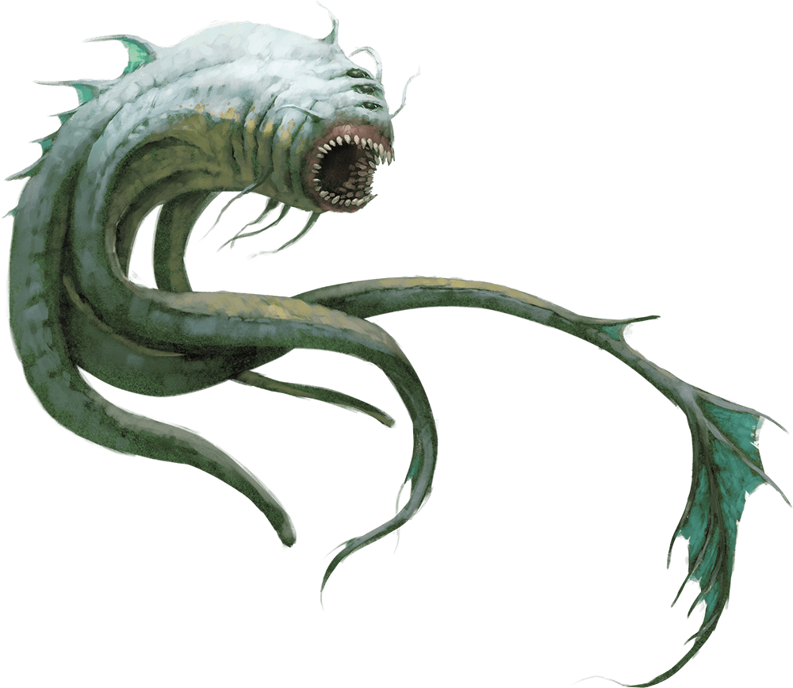

# Palette de Peinture – [Aboleth](https://www.dndbeyond.com/monsters/16762-aboleth)

[‹ Back](../index.md)

L’[Aboleth](https://www.dndbeyond.com/monsters/16762-aboleth) est une abomination ancestrale, dotée d’une mémoire immortelle, d’un corps aquatique tentaculaire et d’un pouvoir psionique.

Sa peau gluante est souvent décrite comme bleu-vert, violacée ou translucide, luisant dans les profondeurs abyssales.

---

## 🐙 Apparence – Terreur psionique des profondeurs

| Zone                | Couleur            | Commentaire                                      |
| ------------------- | ------------------ | ------------------------------------------------ |
| Peau principale     | Lizardfolk Cyan 🛒 | Base turquoise aquatique, amphibienne            |
| Ombres / creux      | Occultist Cloak ✅ | Renforce les volumes, plis et rainures           |
| Reflets psioniques  | Magic Blue 🛒      | Halo subtil autour de la tête ou tentacules      |
| Ventres / membranes | Holy White 🛒      | Zone translucide et gluante                      |
| Détails sombres     | Grim Black ✅      | Pour les bouches, yeux ou appendices secondaires |

---

## ✅ Couleurs en ta possession

- Occultist Cloak
- Grim Black

## 🛒 Recommandations

- **Lizardfolk Cyan** – Teinte principale aquatique
- **Magic Blue** – Aura mentale ou psionique
- **Holy White** – Reflets aqueux et translucides

---

💡 Pour accentuer la texture organique :

- Applique _Holy White_ ou _Magic Blue_ en glacis sur la base _Lizardfolk Cyan_
- Vernis brillant recommandé sur les tentacules et la tête
- Tu peux peindre une **lueur depuis la bouche ou les yeux** avec _Plasmatic Bolt_ si tu veux une variation surnaturelle

## 🖼️ Illustration

