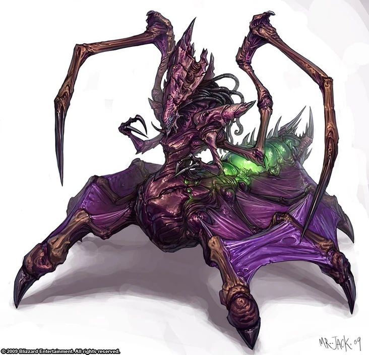

# Palette de Peinture – Chuuls (Dungeons & Dragons + variante matriarche Zerg)

[‹ Back](../index.md)

Les [Chuuls](https://www.dndbeyond.com/monsters/16824-chuul) sont des créatures aberrantes, crustacées et tentaculaires issues des profondeurs.

Voici trois palettes Speedpaint 2.0 pour représenter un groupe de Chuuls :

- Un **matriarche** inspiré de la **Zerg Queen** (Starcraft)
- Deux **variante naturelles / tribales**

---

## 👑 Chuul Matriarche – Variante Zerg Queen

| Zone                          | Couleur            | Commentaire                                         |
| ----------------------------- | ------------------ | --------------------------------------------------- |
| Carapace dominante            | Purple Swarm ✅    | Base violette intense pour un aspect alien et royal |
| Écailles contrastantes        | Moonlake Coral ✅  | Reflets rosés-violacés vers les extrémités          |
| Ombres / profondeur           | Occultist Cloak ✅ | Pour renforcer les creux, pinces, pattes            |
| Excroissances / sac organique | Plasmatic Bolt ✅  | Sacs ovoïdes, veines ou zones biomécaniques         |
| Griffes / pointes             | Grim Black ✅      | Détail des extrémités, renforts tranchants          |

---

## 🪨 Chuul des Profondeurs – Variante naturelle (roche / algue)

| Zone              | Couleur           | Commentaire                        |
| ----------------- | ----------------- | ---------------------------------- |
| Carapace rugueuse | Desolate Brown ✅ | Teinte mate et rocheuse            |
| Ombres épaisses   | Gravelord Grey ✅ | Pour pattes, articulation, creux   |
| Tentacules        | Poppy Red ✅      | Toucher contrastant, organique     |
| Griffes           | Ashen Stone ✅    | Marquage des extrémités calcifiées |

---

## 🧪 Chuul des Marais – Variante toxique ou mutée

| Zone             | Couleur             | Commentaire                                     |
| ---------------- | ------------------- | ----------------------------------------------- |
| Carapace verte   | Absolution Green ✅ | Pour une teinte surnaturelle, presque acide     |
| Reflets maladifs | Nuclear Sunrise ✅  | Veines, œufs, pustules ou articulation instable |
| Ombres           | Occultist Cloak ✅  | Pour ancrer le tout dans un contraste fangeux   |
| Tentacules       | Pallid Bone ✅      | Os nus ou membranes pâles organiques            |

---

## ✅ Couleurs en ta possession

- Purple Swarm
- Moonlake Coral
- Occultist Cloak
- Plasmatic Bolt
- Grim Black
- Desolate Brown
- Gravelord Grey
- Poppy Red
- Ashen Stone
- Absolution Green
- Nuclear Sunrise
- Pallid Bone

---

💡 Tu peux accentuer les différences entre les Chuuls par :

- Des **yeux lumineux** (Magic Blue, Plasmatic Bolt)
- Des **textures spéciales** (vernis brillant sur pustules ou carapace)
- Un **brossage sec inversé** (Holy White sur extrémités sombres)

## 🖼️ Illustrations

