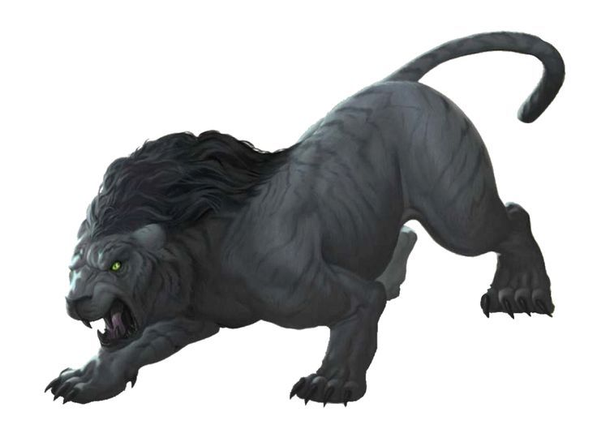

# Palette de Peinture – [Mngwa](https://www.5esrd.com/database/creature/mngwa-3pp/)

[‹ Back](../index.md)

Le [Mngwa](https://www.5esrd.com/database/creature/mngwa-3pp/) est une créature féline surnaturelle originaire du mythe africain.

Sa fourrure est noire ou gris charbon, sa silhouette massive et menaçante, presque démoniaque.

---

## 🐆 Apparence – Grand fauve nocturne

| Zone                     | Couleur            | Commentaire                                 |
| ------------------------ | ------------------ | ------------------------------------------- |
| Fourrure principale      | Grim Black ✅      | Teinte très sombre et matte pour la base    |
| Reflets musculaires      | Gravelord Grey ✅  | Pour modeler les volumes et zones éclairées |
| Crinière / poils épais   | Occultist Cloak ✅ | Accentuer la densité de la crinière         |
| Griffes / crocs / museau | Ashen Stone ✅     | Os terni ou corne noire                     |
| Yeux / éclats féroces    | Zealot Yellow ✅   | Contraste vif, regard de prédateur          |

---

## ✅ Couleurs en ta possession

- Grim Black
- Gravelord Grey
- Occultist Cloak
- Ashen Stone
- Zealot Yellow

---

💡 Brosse légèrement _Gravelord Grey_ sur le pelage pour révéler les reliefs.  
Un **lavis ciblé de _Occultist Cloak_** sur la crinière donne un effet de profondeur.  
Utilise _Zealot Yellow_ pur ou mélangé à _Holy White_ si tu veux un regard plus spectral.

## 🖼️ Illustration

