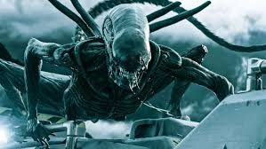

# Palette de Peinture – [Xenomorphs](https://en.wikipedia.org/wiki/Xenomorph)

[‹ Back](../index.md)

Les [Xenomorphs](https://en.wikipedia.org/wiki/Xenomorph) sont des créatures extraterrestres sombres, lisses et parfaitement adaptées à la traque.

Leur esthétique noire et brillante peut varier subtilement pour refléter l’environnement ou la mutation.

Voici deux variantes de peinture pour différencier deux Xénomorphes tout en conservant leur caractère terrifiant.

---

## 👽 Xenomorph n°1 – Noir violacé classique

| Zone                     | Couleur                | Commentaire                                        |
| ------------------------ | ---------------------- | -------------------------------------------------- |
| Carapace principale      | Grim Black ✅          | Base très sombre, lisse et uniforme                |
| Reflets / volumes        | Hive Dweller Purple 🛒 | Pourpre profond dans les reflets, donne du mystère |
| Ombres intérieures       | Occultist Cloak ✅     | Plis sombres, creux intercostaux                   |
| Dents / griffes          | Ashen Stone ✅         | Os froid, réaliste, discret                        |
| Bave ou reflets mouillés | Holy White 🛒          | Pour glacis ou reflets brillants                   |

---

## 👽 Xenomorph n°2 – Noir bronze/terre

| Zone                | Couleur            | Commentaire                     |
| ------------------- | ------------------ | ------------------------------- |
| Carapace principale | Desolate Brown ✅  | Teinte brun-noir, plus chaude   |
| Ombres profondes    | Occultist Cloak ✅ | Contraste marqué                |
| Rehauts / plaques   | Brownish Decay ✅  | Éclaircissements terreux        |
| Griffes / os        | Pallid Bone ✅     | Os morts, extrémités classiques |
| Détail visqueux     | Plasmatic Bolt ✅  | Pour quelques reflets étranges  |

---

## ✅ Couleurs en ta possession

- Grim Black
- Occultist Cloak
- Ashen Stone
- Desolate Brown
- Brownish Decay
- Pallid Bone
- Plasmatic Bolt

## 🛒 Recommandations

- **Hive Dweller Purple** – Rehauts violacés de carapace
- **Holy White** – Pour effets brillants ou buccaux

---

💡 Tu peux vernir les deux modèles avec un **vernis satiné ou brillant** pour accentuer l’aspect luisant de la carapace.  
Utilise un **glaze de Hive Dweller Purple** sur le noir pour un effet subtil et alien, ou un brossage très léger de _Brownish Decay_ pour l’autre.

## 🖼️ Illustration

