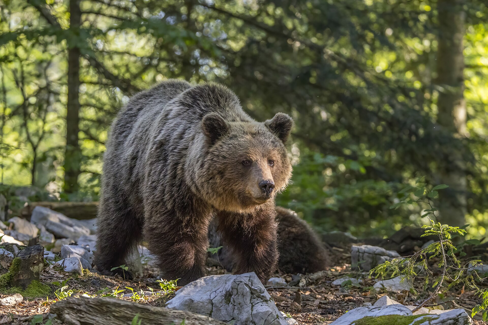

# Palette de Peinture – Giant Eurasian Brown Bear et Cubs

[‹ Back](../index.md)

Cette fiche propose une palette de couleurs **Army Painter Speedpaint 2.0** pour peindre un [ours brun eurasien](https://en.wikipedia.org/wiki/Eurasian_brown_bear) géant (_Ursus arctos arctos_) et ses deux petits.

Les couleurs sont choisies pour évoquer un pelage naturel, avec des variations subtiles entre adulte et jeunes.

---

## 🐻 Ours Adulte – Giant Brown Bear

| Usage                         | Couleur             | Commentaire                                     |
| ----------------------------- | ------------------- | ----------------------------------------------- |
| Base principale               | Dark Wood 🛒        | Brun foncé profond, idéal pour le pelage adulte |
| Ombres profondes              | Gravelord Grey ✅   | Pour foncer pattes, ventre et museau            |
| Reflets chauds sur le dos     | Hardened Leather 🛒 | Ajoute de la chaleur et du relief               |
| Détails froids (museau, yeux) | Ashen Stone ✅      | Pour zones grises naturelles                    |

---

## 🐾 Oursons – Cubs

| Ourson | Couleur de base  | Effets / Reflets supplémentaires |
| ------ | ---------------- | -------------------------------- |
| N°1    | Ruddy Fur ✅     | Brun doux et rougeâtre           |
| N°2    | Satchel Brown ✅ | Brun neutre plus clair           |

Ajoute des reflets ou éclaircissements légers avec :

- **Blinding Light ✅** ou **Holy White 🛒** pour le museau et les extrémités
- **Pallid Bone ✅** dilué pour simuler un pelage plus doux ou jeune

---

## ✅ Couleurs que tu possèdes déjà

- Gravelord Grey
- Ruddy Fur
- Satchel Brown
- Ashen Stone
- Blinding Light
- Occultist Cloak
- Pallid Bone

## 🛒 À considérer pour achat

- Dark Wood
- Hardened Leather
- Holy White

---

Utilise les contrastes naturels du Speedpaint 2.0 pour donner du relief et un aspect sauvage à ces magnifiques bêtes !

## 🖼️ Illustration

