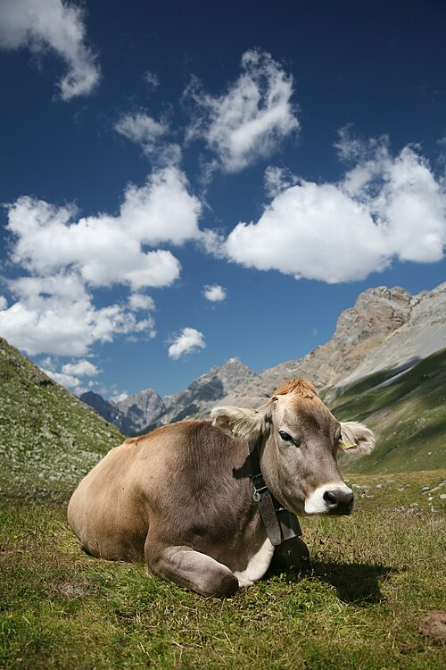
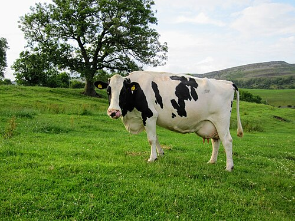

# Palette de Peinture – Vaches domestiques

[‹ Back](../index.md)

Voici une palette Speedpaint 2.0 pour peindre une paire de vaches réalistes :

- Une [Holstein-Friesian](https://en.wikipedia.org/wiki/Holstein_Friesian), vache noire et blanche emblématique
- Une vache brune de type [Braunvieh](https://en.wikipedia.org/wiki/Braunvieh), une race suisse robuste et docile

---

## 🐄 Holstein-Friesian – Vache noire et blanche

| Zone            | Couleur           | Commentaire                                     |
| --------------- | ----------------- | ----------------------------------------------- |
| Taches noires   | Grim Black ✅     | Couleur solide, couvrante, non brillante        |
| Zones blanches  | Pallid Bone ✅    | Base ivoire réaliste (plus doux que Holy White) |
| Ombres / plis   | Gravelord Grey ✅ | Pour ombrer sous le ventre, cou ou sabots       |
| Cornes / sabots | Ashen Stone ✅    | Gris osseux ou sabots foncés                    |
| Mufle / naseaux | Brownish Decay ✅ | Teinte chaude et organique pour le nez          |

---

## 🐄 Braunvieh – Vache brune

| Zone             | Couleur            | Commentaire                                     |
| ---------------- | ------------------ | ----------------------------------------------- |
| Pelage principal | Brownish Decay ✅  | Base chaude, adaptée au pelage uniforme         |
| Ombres profondes | Gravelord Grey ✅  | Pour les creux musculaires                      |
| Cornes / sabots  | Ashen Stone ✅     | Couleur d’os ou corne naturelle                 |
| Yeux / creux     | Occultist Cloak ✅ | Accentuation douce autour du regard             |
| Mufle / naseaux  | Pallid Bone ✅     | Pour les contours du nez et la lèvre inférieure |

---

## ✅ Couleurs utilisées

- Grim Black
- Pallid Bone
- Gravelord Grey
- Ashen Stone
- Brownish Decay
- Occultist Cloak

---

💡 Pour un effet plus réaliste, tu peux :

- Appliquer un **glaze fin de Gravelord Grey** sur la robe blanche de la Holstein pour simuler l’ombre naturelle.
- Brosser légèrement _Pallid Bone_ sur la robe de la Braunvieh pour refléter la lumière du jour.

## 🖼️ Illustrations

