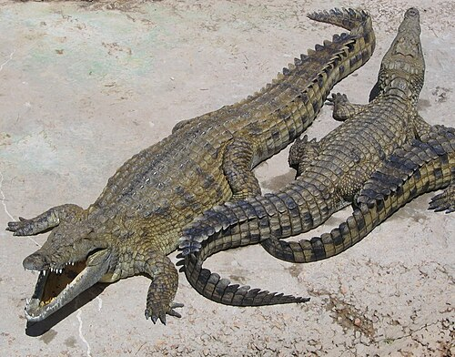
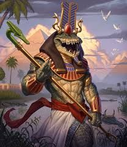

# Palette de Peinture – Crocodiles (Crocodylus niloticus et variantes fantastiques)

[‹ Back](../index.md)

Le [crocodile du Nil](https://en.wikipedia.org/wiki/Nile_crocodile) (Crocodylus niloticus) est une créature redoutable, symbolisant la **puissance, la patience et la sauvagerie ancestrale**.

Voici une fiche de palettes Speedpaint 2.0 pour :

- **1 crocodile géant**
- **2 crocodiles réalistes**
- **1 crocodile domestique nommé Snoodle**
- **1 Crocobear**
- [1 représentation divine de Sobek](https://en.wikipedia.org/wiki/Sobek)

---

## 🐊 Crocodile Géant – Ancien et intimidant

| Zone                 | Couleur            | Commentaire                   |
| -------------------- | ------------------ | ----------------------------- |
| Écailles principales | Desolate Brown ✅  | Teinte mate et rugueuse       |
| Ombres               | Gravelord Grey ✅  | Pour les plis, les creux      |
| Dents / griffes      | Pallid Bone ✅     | Détail osseux sec             |
| Crête / dos          | Grim Black ✅      | Plaques dorsales plus foncées |
| Yeux                 | Nuclear Sunrise ✅ | Regard jaune, intense         |

---

## 🐊 Crocodile 1 – Réaliste olive-brun

| Zone            | Couleur            | Commentaire                            |
| --------------- | ------------------ | -------------------------------------- |
| Corps principal | Ghillie Dew 🛒     | Vert olive typique du crocodile du Nil |
| Ombres          | Occultist Cloak ✅ | Creux sombres naturels                 |
| Griffes / dents | Pallid Bone ✅     | Détails organiques                     |
| Yeux            | Poppy Red ✅       | Yeux animaliers vifs                   |

---

## 🐊 Crocodile 2 – Réaliste gris-terre

| Zone            | Couleur            | Commentaire                   |
| --------------- | ------------------ | ----------------------------- |
| Corps principal | Ashen Stone ✅     | Variante grise naturelle      |
| Ombres          | Gravelord Grey ✅  | Profondeur                    |
| Dos / crête     | Brownish Decay ✅  | Dorsale plus terreuse ou sale |
| Yeux            | Nuclear Sunrise ✅ | Éclat fauve                   |

---

## 🐊 Snoodle – Crocodile domestique avec couronne

| Zone            | Couleur            | Commentaire                  |
| --------------- | ------------------ | ---------------------------- |
| Corps mignon    | Algae Green 🛒     | Vert tendre, moins agressif  |
| Ombres douces   | Runic Grey 🛒      | Creux subtils                |
| Yeux expressifs | Magic Blue 🛒      | Regard doux, presque cartoon |
| Couronne dorée  | Nuclear Sunrise ✅ | Pour un doré brillant        |
| Griffe / ventre | Pallid Bone ✅     | Naturel, propre              |

---

## 🐊🐻 Crocobear – Hybride ours / crocodile

| Zone                 | Couleur           | Commentaire                           |
| -------------------- | ----------------- | ------------------------------------- |
| Écailles dorsales    | Grim Black ✅     | Pour les plaques plus sombres         |
| Corps principal      | Ruddy Fur ✅      | Base de pelage / texture hybride      |
| Griffes puissantes   | Ashen Stone ✅    | Osseux ou calcifiés                   |
| Ombres / transitions | Gravelord Grey ✅ | Unifie les zones animales et reptiles |
| Yeux de prédateur    | Poppy Red ✅      | Regard menaçant                       |

---

## 🐊⚜️ Sobek – Dieu crocodilien

| Zone                | Couleur            | Commentaire                   |
| ------------------- | ------------------ | ----------------------------- |
| Peau divine         | Plasmatic Bolt ✅  | Reflet surnaturel turquoise   |
| Ombres divines      | Occultist Cloak ✅ | Profondeur mystique           |
| Dents / ongles      | Pallid Bone ✅     | Os brillants et précis        |
| Yeux solaires       | Nuclear Sunrise ✅ | Aura dorée et puissante       |
| Tissus / vêtements  | Royal Robes ✅     | Vêtement noble, étoffe divine |
| Détails or / joyaux | Holy White 🛒      | Lumière ou sertissage         |

---

## ✅ Couleurs en ta possession

- Desolate Brown
- Gravelord Grey
- Pallid Bone
- Grim Black
- Nuclear Sunrise
- Occultist Cloak
- Poppy Red
- Ashen Stone
- Ruddy Fur
- Plasmatic Bolt
- Royal Robes
- Brownish Decay

## 🛒 À considérer pour achat

- **Ghillie Dew** – Pour crocodile vert naturel
- **Algae Green** – Snoodle ou crocodile cartoon
- **Runic Grey** – Pour des ombres douces
- **Magic Blue** – Yeux brillants, Snoodle ou Sobek
- **Holy White** – Reflets divins, couronne, bijoux

---

💡 Pour Sobek et Snoodle, un vernis **satiné ou brillant** sur le corps crée un effet peau humide.  
Pour le Crocobear, brosse _Ruddy Fur_ sur les zones hautes pour rappeler l’ours, et _Grim Black_ sur le dos pour les plaques.

## 🖼️ Illustrations

