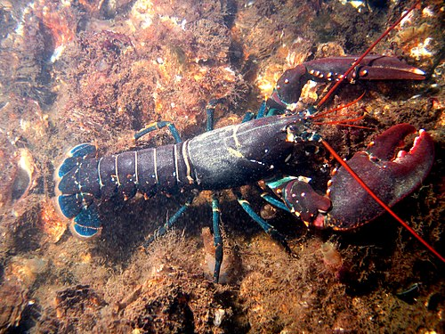

# Palette de Peinture – Homard Européen (_Homarus gammarus_)

[‹ Back](../index.md)

Ce homard est un [homard européen](https://en.wikipedia.org/wiki/Lobster), identifiable par sa **carapace bleu-noir**, ses **reflets turquoise sur les pattes**, ses **taches claires**, et ses **antennes rouges vives**.

Voici une palette réaliste pour le représenter avec les peintures **Army Painter Speedpaint 2.0**.

---

## 🦞 Informations générales

- **Nom scientifique** : _Homarus gammarus_
- **Origine** : Atlantique Nord-Est, Manche, Méditerranée
- **Caractéristiques visuelles** :
  - Carapace noire à bleu nuit
  - Rayures claires et ivoire
  - Pattes aux reflets turquoise
  - Antennes et intérieur des pinces rouge vif

---

## 🎨 Palette Speedpaint 2.0 – Homard Européen

| Zone                             | Couleur recommandée               | Commentaire                                                   |
| -------------------------------- | --------------------------------- | ------------------------------------------------------------- |
| Carapace principale              | Grim Black ✅ + Royal Robes ✅    | Base noire avec glaze de bleu profond pour les reflets marins |
| Reflets bleu-vert sur les pattes | Plasmatic Bolt ✅                 | Idéal pour recréer l’iridescence turquoise                    |
| Rayures claires et articulations | Ashen Stone ✅                    | Pour les marques ivoire et lignes segmentées                  |
| Antennes et intérieur des pinces | Poppy Red ✅ / Nuclear Sunrise ✅ | Pour les parties rouges et chaudes                            |
| Ombres générales                 | Gravelord Grey ✅                 | Pour renforcer les creux et textures                          |

---

## ✅ Couleurs en ta possession

- Grim Black
- Royal Robes
- Plasmatic Bolt
- Ashen Stone
- Poppy Red
- Nuclear Sunrise
- Gravelord Grey

---

## 🛒 À considérer pour achat

- **Magic Blue** (pour reflets bleus froids sur la carapace)
- **Holy White** (pour éclaircissements subtils)
- **Runic Grey** (pour une variante stylisée ou minérale)

---

💡 Pour un rendu réaliste : applique _Grim Black_ en base, puis _Royal Robes_ en glaze ou fine couche sur les volumes supérieurs.  
Ajoute _Plasmatic Bolt_ dilué sur les pattes et finitions _Ashen Stone_ pour marquer les segments et griffes.  
_Poppy Red_ ou _Nuclear Sunrise_ peuvent rehausser les antennes ou les reflets chauds de la pince dominante.

## 🖼️ Illustration

