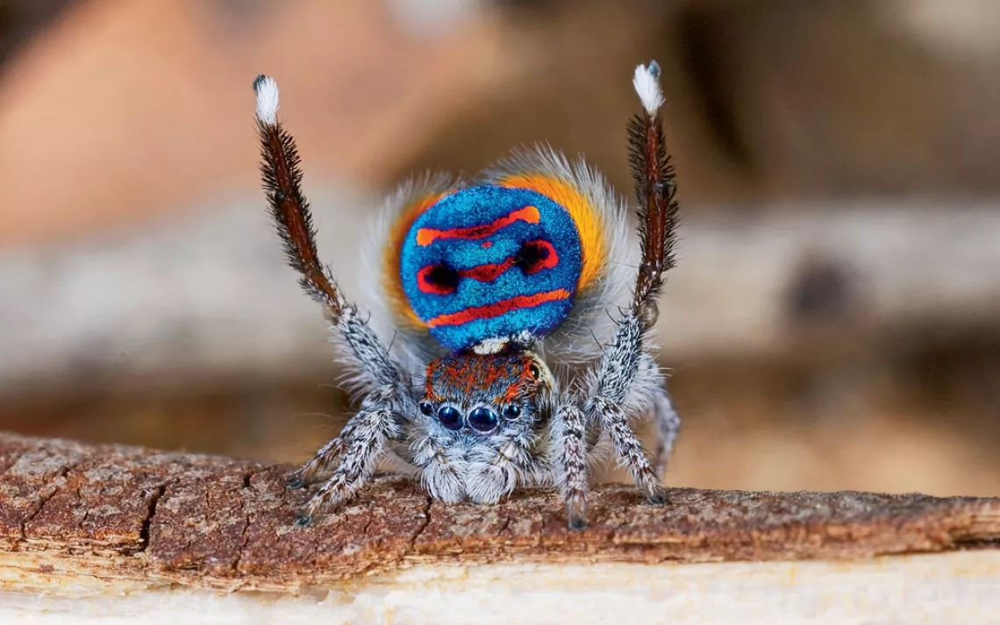

# Palette de Peinture – Peacock Spider (_Maratus spp._)

[‹ Back](../index.md)

La [Peacock Spider](https://en.wikipedia.org/wiki/Maratus_volans) est une minuscule araignée sauteuse australienne de la famille des _Salticidae_.

Célèbre pour ses **couleurs vives** et ses parades nuptiales spectaculaires, elle est parfaite pour une peinture de type "showpiece" ou d’ambiance fantastique.

---

## 🕷️ Informations générales

- **Nom scientifique** : _Maratus spp._
- **Famille** : Salticidae (araignées sauteuses)
- **Taille** : 4 à 6 mm
- **Région** : Australie (principalement)
- **Comportement** :
  - Les mâles effectuent une parade colorée avec leur abdomen
  - Très vives, rapides, et sautent pour chasser ou fuir

---

## 🎨 Palette Speedpaint 2.0 – Peacock Spider

| Usage                              | Couleur                | Commentaire                                               |
| ---------------------------------- | ---------------------- | --------------------------------------------------------- |
| Base sombre (pattes, ombres)       | Grim Black ✅          | Idéal pour l’exosquelette de base                         |
| Abdomen bleu brillant              | Royal Robes ✅         | Pour le bleu profond et électrique                        |
| Motifs rouges                      | Poppy Red ✅           | Pour les ronds, traits ou bords vifs                      |
| Reflets verts/jaunes               | Charming Chartreuse ✅ | Pour le contour irisé ou les reflets latéraux             |
| Petites marques claires/blanches   | Holy White 🛒          | Pour les yeux, les pattes claires ou les zones très vives |
| Autres détails (reflets, bordures) | Magic Blue 🛒          | Pour varier les bleus ou créer des transitions de teinte  |

---

## ✅ Couleurs déjà disponibles

- Grim Black
- Royal Robes
- Poppy Red
- Charming Chartreuse

## 🛒 À considérer pour achat

- **Holy White** (si tu veux des reflets ou des taches très vives)
- **Magic Blue** (si tu veux un deuxième bleu contrasté ou une transition)

---

💡 Utilise des couches fines et de très petits pinceaux pour poser des points ou traits vifs sur l'abdomen. Un drybrush inversé (blanc sur noir) peut aussi accentuer les reflets.  
Parfait pour un rendu réaliste ou psychédélique selon ton univers.

## 🖼️ Illustration

