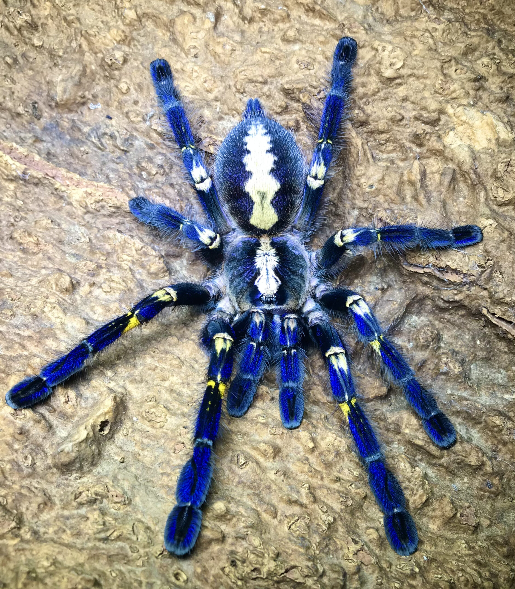

# Palette de Peinture – Poecilotheria metallica (Peacock Tarantula)

[‹ Back](../index.md)

La [Poecilotheria metallica](https://en.wikipedia.org/wiki/Poecilotheria_metallica), aussi appelée **Peacock Tarantula**, est une espèce rare et magnifique de tarentule originaire d’Inde.

Elle est célèbre pour sa **robe bleue métallique irisée** avec des **marques blanches** et parfois **jaunâtres**, lui donnant un aspect presque magique.

---

## 🕷️ Informations générales

- **Nom scientifique** : _Poecilotheria metallica_
- **Nom commun** : Peacock Tarantula
- **Famille** : Theraphosidae (tarentules)
- **Taille** : Jusqu’à 20 cm d’envergure
- **Région** : Forêts du sud de l’Inde (région de Gooty)
- **Statut** : En danger critique (IUCN)
- **Particularités** :
  - Teinte bleue iridescente sur l’ensemble du corps
  - Rayures et bandes blanches / crème
  - Pattes velues et épaisses

---

## 🎨 Palette Speedpaint 2.0 – Peacock Tarantula

| Usage                           | Couleur            | Commentaire                                              |
| ------------------------------- | ------------------ | -------------------------------------------------------- |
| Base du corps / bleu métallique | Royal Robes ✅     | Idéal pour la teinte bleue saturée                       |
| Contrastes bleus plus froids    | Magic Blue 🛒      | Pour créer des nuances froides ou métalliques            |
| Rayures / détails pâles         | Holy White 🛒      | Pour les bandes sur les pattes ou le céphalothorax       |
| Ombres profondes                | Grim Black ✅      | Parfait pour les interstices et les poils denses         |
| Rehauts brillants               | Blinding Light ✅  | À utiliser pur ou mélangé pour éclaircir certaines zones |
| Touches chaudes secondaires     | Nuclear Sunrise ✅ | Pour des nuances très légères sur les reflets            |

---

## ✅ Couleurs en ta possession

- Royal Robes
- Grim Black
- Blinding Light
- Nuclear Sunrise

## 🛒 À considérer pour achat

- **Magic Blue** (pour profondeur bleutée plus froide)
- **Holy White** (pour bandes nettes, yeux ou pattes)

---

💡 Cette tarentule étant très visuelle, tu peux jouer sur les effets d’iridescence avec plusieurs couches fines.  
Un lavis léger ou une dilution au medium peut aider à faire briller les transitions bleues et créer un effet de **lumière vivante**.

## 🖼️ Illustration

