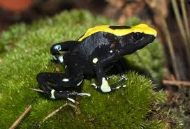
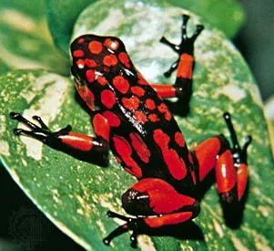
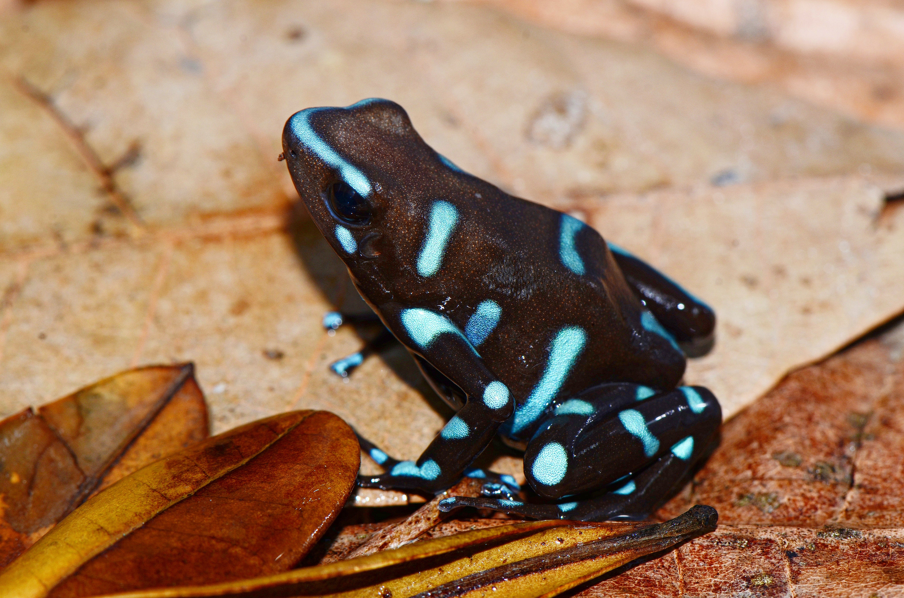
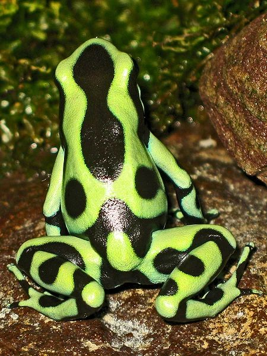

# Palette de Peinture – Dendrobates (Grenouilles flèches)

[‹ Back](../index.md)

Ces grenouilles tropicales très colorées appartiennent au genre [Dendrobates](https://en.wikipedia.org/wiki/Dendrobates) (ou _Dendrobatidae_).

Chacune a une livrée vive et contrastée pour avertir les prédateurs de leur toxicité.

Voici une palette Speedpaint 2.0 pour chaque morphologie présentée en image.

---

## 🟦 Dendrobate bleue sur fond brun foncé

| Zone                  | Couleur recommandée | Commentaire                         |
| --------------------- | ------------------- | ----------------------------------- |
| Corps brun foncé      | Grim Black ✅       | Base sombre neutre                  |
| Marquages bleu vif    | Plasmatic Bolt ✅   | Reflets cyan irisés                 |
| Éclats ou transitions | Magic Blue 🛒       | Transitions plus douces si désirées |

---

## 🟩 Dendrobate vert fluo et noire (Green and Black Poison Dart Frog)

| Zone               | Couleur recommandée    | Commentaire                                  |
| ------------------ | ---------------------- | -------------------------------------------- |
| Corps noir profond | Grim Black ✅          | Pour une base unifiée                        |
| Taches vert fluo   | Charming Chartreuse ✅ | Idéal pour reproduire la teinte vibrante     |
| Ombres             | Gravelord Grey ✅      | Pour lisser ou ombrer subtilement les motifs |

---

## 🟨 Dendrobate jaune et noire (Bumblebee Poison Dart Frog)

| Zone                       | Couleur recommandée | Commentaire                               |
| -------------------------- | ------------------- | ----------------------------------------- |
| Corps noir de base         | Grim Black ✅       | Base solide et couvrante                  |
| Tête et motifs jaunes      | Nuclear Sunrise ✅  | Jaune vif tirant légèrement vers l’orange |
| Rehauts / éclaircissements | Holy White 🛒       | Pour les points de lumière sur les jaunes |

---

## 🟥 Dendrobate rouge et noire (Strawberry Poison Dart Frog)

| Zone                         | Couleur recommandée | Commentaire                         |
| ---------------------------- | ------------------- | ----------------------------------- |
| Corps rouge vif              | Poppy Red ✅        | Teinte chaude et saturée            |
| Membres noirs / reflets      | Grim Black ✅       | Parfait pour les pattes             |
| Motifs plus clairs / reflets | Pallid Bone ✅      | Pour ajouter du contraste organique |

---

## ✅ Couleurs en ta possession

- Grim Black
- Plasmatic Bolt
- Poppy Red
- Pallid Bone
- Charming Chartreuse
- Gravelord Grey
- Nuclear Sunrise

## 🛒 À considérer pour achat

- **Magic Blue**
- **Holy White**

---

💡 Ces grenouilles sont petites mais éclatantes. N’hésite pas à utiliser des brossages très contrôlés ou des pointillés pour simuler la texture de peau et les motifs complexes.

## 🖼️ Illustrations

