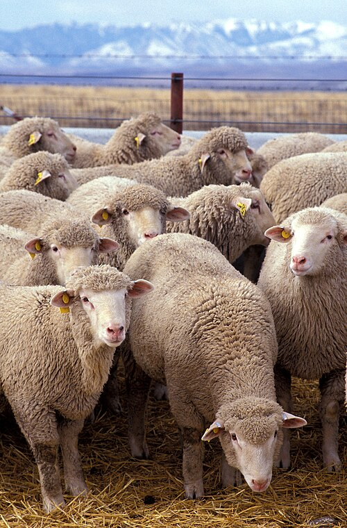

# Palette – [Sheep](https://en.wikipedia.org/wiki/Sheep)

[‹ Back](../index.md)

## 🐑 Mouton blanc

- **Laine**: Holy White 🛒
- **Visage / jambes**: Ashen Stone ✅

## 🐏 Mouton noir

- **Laine**: Grim Black ✅
- **Museau / pattes**: Pallid Bone ✅

## 🐏 Mouton brun

- **Laine**: Brownish Decay ✅
- **Ombres**: Occultist Cloak ✅

## 🐏 Mouton gris clair

- **Laine**: Runic Grey 🛒
- **Contraste**: Gravelord Grey ✅

## 🖼️ Illustration

