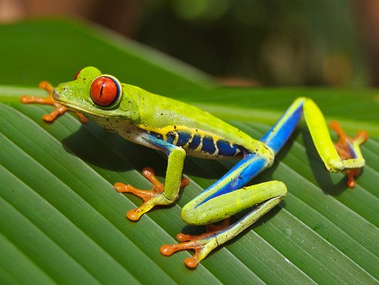

# Tlalocohyla celeste - Palette de Peinture Speedpaint 2.0

[‹ Back](../index.md)

Cette fiche présente une palette de couleurs **Speedpaint 2.0** recommandée pour peindre la grenouille [Tlalocohyla celeste](https://en.wikipedia.org/wiki/Tapir_Valley_tree_frog), récemment découverte au Costa Rica.

Elle est reconnaissable à sa **peau verte** et ses **extrémités rouge vif**.

## 🎨 Recommandations de couleurs Speedpaint 2.0

| Type   | Couleur         | Utilisation                           |
| ------ | --------------- | ------------------------------------- |
| Vert   | Malignant Green | Peau éclatante, grenouille tropicale  |
| Vert   | Ghillie Dew     | Grenouille camouflage / marais        |
| Rouge  | Blood Red       | Pattes rouge sombre, grenouille n°2   |
| Rouge  | Burnished Red   | Pattes rouge brunâtre, grenouille n°3 |
| Neutre | Holy White      | Détails yeux / ventre                 |

## 🖼️ Illustration

