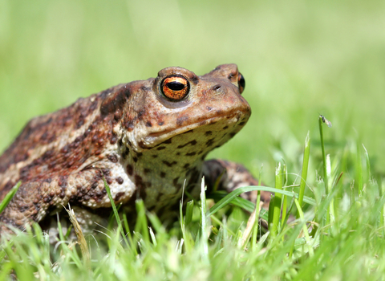

# Palette de Peinture – Crapauds communs d’Europe (Bufo bufo)

[‹ Back](../index.md)

Les [crapauds communs d’Europe](https://en.wikipedia.org/wiki/Common_toad) sont des amphibiens terrestres robustes, à la peau rugueuse et verruqueuse.

Leur coloration naturelle varie du **brun au gris**, en passant par des teintes **rousses** ou **vert olive**, selon leur environnement.

Voici une palette Speedpaint 2.0 pour peindre **3 crapauds différents mais réalistes**, avec recommandations d’achat pour enrichir tes options.

---

## 🐸 Crapaud n°1 – Brun terreux (classique forestier)

| Zone                   | Couleur           | Commentaire                           |
| ---------------------- | ----------------- | ------------------------------------- |
| Peau principale        | Brownish Decay ✅ | Base chaude et naturelle              |
| Ombres / plis          | Gravelord Grey ✅ | Pour renforcer la texture verruqueuse |
| Ventre / doigts clairs | Pallid Bone ✅    | Pour le dessous ou les extrémités     |
| Yeux                   | Poppy Red ✅      | Iris rougeâtre ou doré intense        |

---

## 🐸 Crapaud n°2 – Gris froid (roche / montagne)

| Zone                | Couleur            | Commentaire                             |
| ------------------- | ------------------ | --------------------------------------- |
| Peau principale     | Ashen Stone ✅     | Gris neutre très adapté                 |
| Ombres / contrastes | Occultist Cloak ✅ | Accentue les formes                     |
| Ventre pâle         | Holy White 🛒      | Pour un contraste doux avec la carapace |
| Yeux brillants      | Magic Blue 🛒      | Reflet froid et animal                  |

---

## 🐸 Crapaud n°3 – Olive / roussâtre (champ ou marais)

| Zone                     | Couleur            | Commentaire                        |
| ------------------------ | ------------------ | ---------------------------------- |
| Peau principale          | Ghillie Dew 🛒     | Vert-olive organique               |
| Ombres brunes            | Ruddy Fur ✅       | Pour salissures ou nuances chaudes |
| Verrues / reflets clairs | Sand Golem 🛒      | Taches beiges ou plus claires      |
| Yeux                     | Nuclear Sunrise ✅ | Regard brillant, doré ou ambré     |

---

## ✅ Couleurs que tu possèdes déjà

- Brownish Decay
- Gravelord Grey
- Pallid Bone
- Poppy Red
- Ashen Stone
- Occultist Cloak
- Ruddy Fur
- Nuclear Sunrise

## 🛒 Recommandations d’achat

- **Holy White** – Ventre pâle ou reflets lumineux
- **Magic Blue** – Iris froid, contraste animal
- **Ghillie Dew** – Parfait pour vert naturel organique
- **Sand Golem** – Pour les verrues ou textures beiges

---

💡 Les crapauds ont souvent un dos rugueux avec taches irrégulières. Tu peux :

- **Speckler à sec** avec _Gravelord Grey_ ou _Ruddy Fur_
- **Glazer** très légèrement avec _Holy White_ ou _Sand Golem_
- **Peindre des pupilles verticales** avec _Grim Black_ ou _Plasmatic Bolt_ pour une touche bestiale

## 🖼️ Illustration

