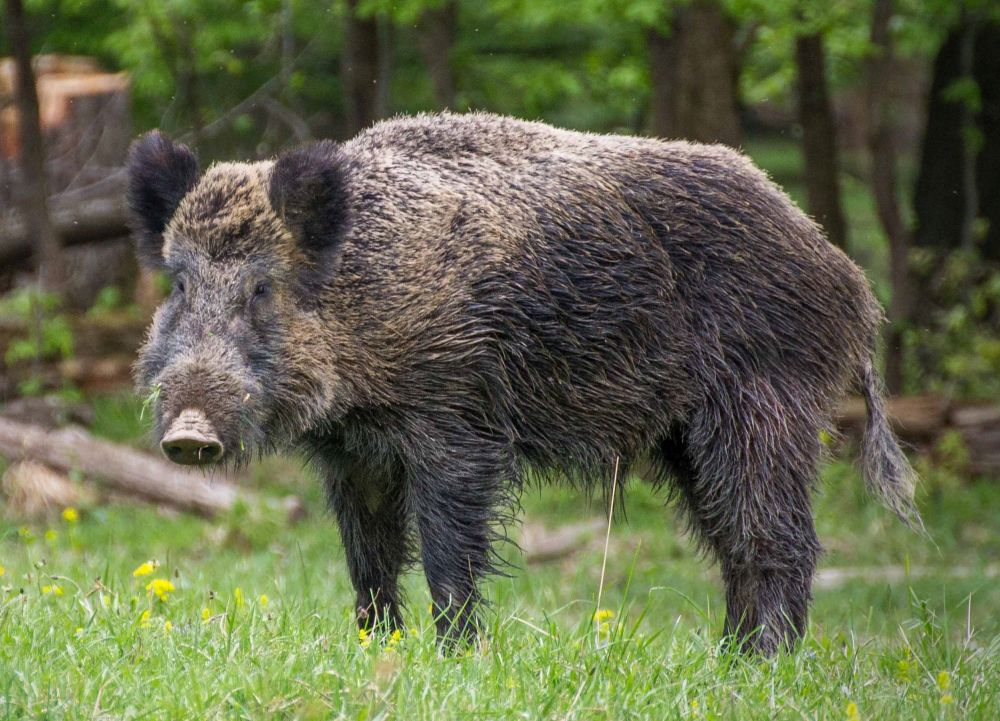

# Palette de Peinture – Sanglier Commun Européen (_Sus scrofa_)

[‹ Back](../index.md)

Le [sanglier commun européen](https://en.wikipedia.org/wiki/Wild_boar) est un mammifère omnivore très répandu en Europe, en Asie et au nord de l'Afrique.

C’est l’ancêtre du cochon domestique, mais il conserve une morphologie rustique : pelage rêche, museau allongé, défenses recourbées, et silhouette trapue.

---

## 🐗 Informations générales

- **Nom scientifique** : _Sus scrofa_
- **Famille** : Suidés
- **Taille** : 90 à 200 kg pour un mâle adulte
- **Répartition** : Europe, Russie, Moyen-Orient, Asie du Sud-Est, Afrique du Nord
- **Habitat** : Forêts tempérées, zones boisées, plaines agricoles
- **Particularités** :
  - Pelage brun très foncé à noir
  - Crinière dorsale ébouriffée
  - Reflets roux ou grisâtres selon l’âge et la saison

---

## 🎨 Palette Speedpaint 2.0 – Sanglier Européen

| Usage                        | Couleur            | Commentaire                                  |
| ---------------------------- | ------------------ | -------------------------------------------- |
| Base du pelage               | Gravelord Grey ✅  | Brun-gris très foncé, parfait pour la base   |
| Reflets roux/chauds          | Ruddy Fur ✅       | Apporte du relief dans la crinière ou le dos |
| Poils plus clairs / ventre   | Ashen Stone ✅     | Pour zones usées ou vieillies du pelage      |
| Crinière dorsale ébouriffée  | Occultist Cloak ✅ | Renforce l’aspect sombre et brut du dos      |
| Détails (défenses, sabots)   | Pallid Bone ✅     | Défenses ivoire et sabots clairs             |
| Rehauts ou poils très clairs | Holy White 🛒      | Drybrush léger pour effet hivernal ou ancien |

---

## ✅ Couleurs déjà disponibles

- Gravelord Grey
- Ruddy Fur
- Ashen Stone
- Occultist Cloak
- Pallid Bone

## 🛒 À considérer pour achat

- **Holy White** (si besoin de tons très clairs ou effet neige)

---

Un bon sanglier aura un pelage **profond, légèrement sale**, avec des teintes mêlées et une crinière contrastée.  
L’usage de **Gravelord Grey** comme base permet un rendu rapide et réaliste avec très peu d’effort.

## 🖼️ Illustration

