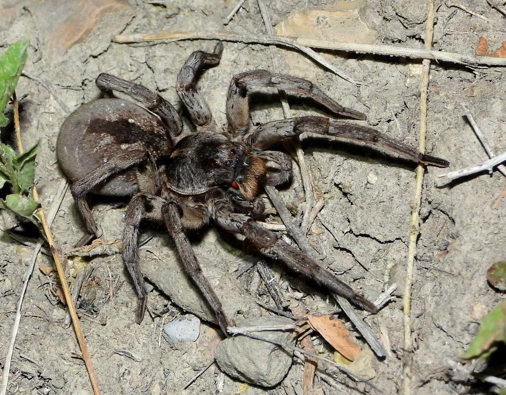

# Palette de Peinture – Wolf Spiders (Hogna carolinensis & Pardosa amentata)

[‹ Back](../index.md)

Cette fiche propose deux palettes **Speedpaint 2.0** adaptées à la peinture des araignées-loups les plus communes d’Amérique du Nord et d’Europe :

la grande [Hogna carolinensis](https://en.wikipedia.org/wiki/Hogna_carolinensis) et la plus petite _Pardosa amentata_.

---

## 🇺🇸 Hogna carolinensis – Carolina Wolf Spider

| Usage                    | Couleur            | Commentaire                                                    |
| ------------------------ | ------------------ | -------------------------------------------------------------- |
| Corps principal          | Grim Black ✅      | Base noire profonde, idéale pour le céphalothorax et l’abdomen |
| Reflets brun foncé       | Dark Wood 🛒       | Teintes secondaires chaudes dans le pelage ou les pattes       |
| Rayures / motifs dorsaux | Ashen Stone ✅     | Pour les marquages clairs et motifs subtils                    |
| Poils légers ou contours | Pallid Bone ✅     | Sec sur les pattes ou abdomen                                  |
| Yeux et détails sombres  | Occultist Cloak ✅ | Ombres des yeux, bouche, creux                                 |

---

## 🇪🇺 Pardosa amentata – Common Wolf Spider (Europe)

| Usage                   | Couleur           | Commentaire                                            |
| ----------------------- | ----------------- | ------------------------------------------------------ |
| Base du corps           | Brownish Decay ✅ | Brun moyen neutre, parfait pour un pelage réaliste     |
| Motif dorsal clair      | Blinding Light ✅ | Pour les motifs foliaires typiques                     |
| Ombres                  | Gravelord Grey ✅ | Accentuation naturelle des segments                    |
| Reflets doux            | Ruddy Fur ✅      | Pour un effet roux/chaud discret                       |
| Poils ou reflets clairs | Holy White 🛒     | Drybrush final pour effet de texture ou éclat lumineux |

---

## ✅ Couleurs en ta possession

- Grim Black
- Ashen Stone
- Pallid Bone
- Occultist Cloak
- Brownish Decay
- Blinding Light
- Gravelord Grey
- Ruddy Fur

## 🛒 À acheter pour compléter

- **Dark Wood** (pour la Hogna)
- **Holy White** (pour les drybrush doux)

---

Utilise de fins pinceaux et des drybrush très légers pour représenter la pilosité fine et les motifs caractéristiques de chaque espèce.  
Les contrastes entre segments et poils sont essentiels pour un rendu réaliste sur des figurines d’arachnides.

## 🖼️ Illustration

