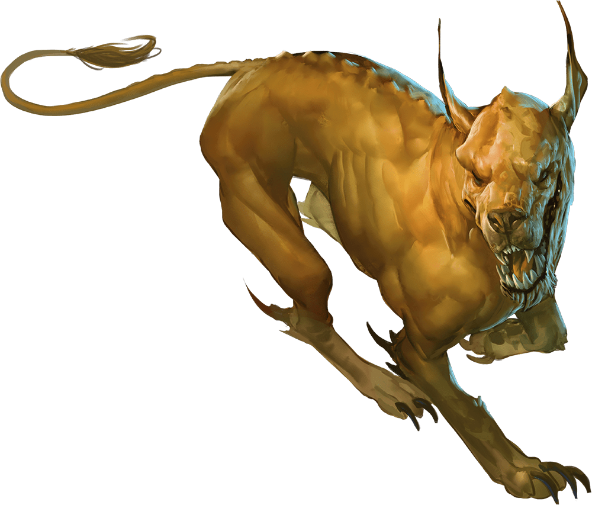

# Palette de Peinture – [Blink Dog](https://www.dndbeyond.com/monsters/16809-blink-dog)

[‹ Back](../index.md)

Le [Blink Dog](https://www.dndbeyond.com/monsters/16809-blink-dog) est un chien féerique capable de se téléporter par bonds dimensionnels.  
Intelligent, loyal, il est souvent l’allié de créatures bonnes ou de fey nobles. Son apparence varie selon sa meute et sa région d’origine.

---

## 🐕 Blink Dog n°1 – Classique féerique

| Zone                | Couleur           | Commentaire                             |
| ------------------- | ----------------- | --------------------------------------- |
| Fourrure principale | Ruddy Fur ✅      | Teinte chaude et canine classique       |
| Ombres              | Gravelord Grey ✅ | Creux musculaires et base des oreilles  |
| Museau / griffes    | Ashen Stone ✅    | Détail osseux clair                     |
| Aura magique        | Plasmatic Bolt ✅ | Pour un effet de téléportation ou lueur |

---

## 🐕 Blink Dog n°2 – Blond doré (noble)

| Zone                | Couleur            | Commentaire                              |
| ------------------- | ------------------ | ---------------------------------------- |
| Fourrure principale | Ancient Honey 🛒   | Teinte dorée chaleureuse et féerique     |
| Ombres              | Brownish Decay ✅  | Pour créer la profondeur                 |
| Truffe / oreille    | Grim Black ✅      | Pour les zones sombres                   |
| Lueurs magiques     | Nuclear Sunrise ✅ | Regard, gorge ou effets magiques subtils |

---

## 🐕 Blink Dog n°3 – Chien des ombres / crépuscule

| Zone                | Couleur            | Commentaire                                   |
| ------------------- | ------------------ | --------------------------------------------- |
| Fourrure principale | Desolate Brown ✅  | Teinte mate et silencieuse                    |
| Ombres              | Occultist Cloak ✅ | Accentue les creux et les transitions sombres |
| Yeux ou runes       | Royal Robes ✅     | Pour des marquages féeriques                  |
| Aura magique        | Magic Blue 🛒      | Pour une téléportation dimensionnelle         |

---

## ✅ Couleurs en ta possession

- Ruddy Fur
- Gravelord Grey
- Ashen Stone
- Brownish Decay
- Grim Black
- Nuclear Sunrise
- Desolate Brown
- Occultist Cloak
- Royal Robes
- Plasmatic Bolt

## 🛒 Recommandations

- **Ancient Honey** – Jaune doré noble et féerique
- **Magic Blue** – Effets magiques de téléportation bleutée

---

💡 Pour représenter leur bond dimensionnel, applique un dégradé magique sur les pattes ou le flanc à base de _Plasmatic Bolt_ ou _Magic Blue_.  
Un brossage doux de _Holy White_ ou _Runic Grey_ peut aussi suggérer une matérialisation partielle.

## 🖼️ Illustration

