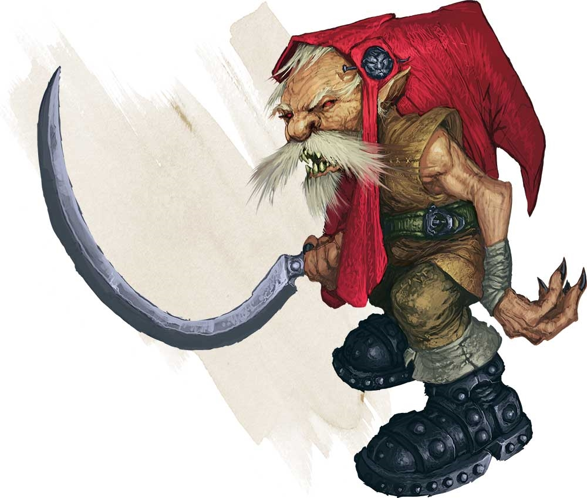

# Palette de Peinture – Redcaps (Dungeons & Dragons)

[‹ Back](../index.md)

Les [Redcaps](http://dndroll.wikidot.com/creatures:redcap-legacy) sont de petites créatures fées meurtrières au folklore sombre.

Dans D&D, ce sont des **êtres sanglants et brutaux**, reconnaissables à leur **bonnet rouge trempé dans le sang de leurs victimes**, leurs **bottes de fer** et leurs rires sadiques.

Voici une palette Speedpaint 2.0 pour peindre **deux Redcaps**, similaires mais avec des variations visuelles pour enrichir le duo.

---

## 🧌 Redcap n°1 – Classique sanguinaire

| Zone                      | Couleur           | Commentaire                                 |
| ------------------------- | ----------------- | ------------------------------------------- |
| Peau pâle et malveillante | Ashen Stone ✅    | Base grisâtre pour l’aspect mort-vivant     |
| Ombres / plis profonds    | Gravelord Grey ✅ | Pour renforcer les volumes du visage        |
| Bonnet ensanglanté        | Poppy Red ✅      | Rouge éclatant et saturé, symbole du Redcap |
| Vêtements (marron sale)   | Satchel Brown ✅  | Pour pagnes, bretelles ou guenilles         |
| Bottes de fer             | Grim Black ✅     | Semelles épaisses, métal grossier           |
| Griffes / dents / détails | Pallid Bone ✅    | Dents saillantes, ongles pointus            |

---

## 🧌 Redcap n°2 – Variation sombre / rouille

| Zone                   | Couleur            | Commentaire                                |
| ---------------------- | ------------------ | ------------------------------------------ |
| Peau cadavérique       | Ashen Stone ✅     | Idem que n°1 mais avec plus de tons froids |
| Ombres et saleté       | Occultist Cloak ✅ | Teinte fangeuse ou ombre magique           |
| Bonnet séché / rouille | Slaughter Red ✅   | Rouge plus foncé, effet sang séché         |
| Vêtements sales / cuir | Brownish Decay ✅  | Linge plus terne, veste sale               |
| Griffes / os           | Pallid Bone ✅     | Pour crocs et serres                       |

---

## ✅ Couleurs en ta possession

- Ashen Stone
- Gravelord Grey
- Poppy Red
- Satchel Brown
- Grim Black
- Pallid Bone
- Occultist Cloak
- Slaughter Red
- Brownish Decay

---

💡 Tu peux renforcer le contraste entre les deux en :

- Ajoutant du sang frais (glaze de _Poppy Red_ ou _Nuclear Sunrise_ brillant)
- Donnant au second des **yeux luisants** (_Plasmatic Bolt_ ou _Magic Blue_) pour un effet possédé

## 🖼️ Illustration

