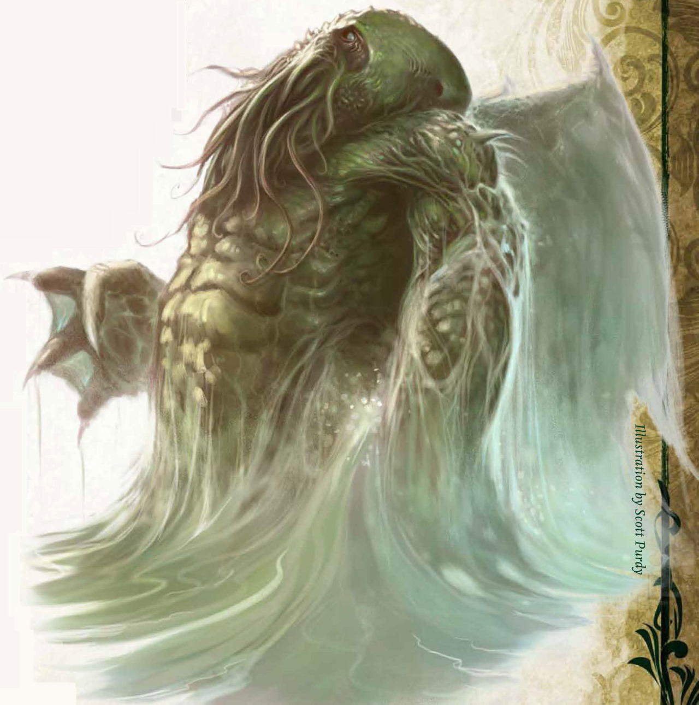

# Palette de Peinture – [Star-Spawn of Cthulhu](https://roll20.net/compendium/coc/Star-Spawn%20of%20Cthulhu#content)

[‹ Back](../index.md)

Le [Star-Spawn of Cthulhu](https://roll20.net/compendium/coc/Star-Spawn%20of%20Cthulhu#content) est l’émissaire titanesque du Grand Ancien lui-même.

Ce monstre est une **entité cosmique et aquatique**, mi-poulpe, mi-dragon, mi-horreur indicible.

Sa silhouette verte, massive et gluante se confond dans les brumes éthérées et les vagues surnaturelles.

---

## 🐙 Apparence principale – Entité cosmique aquatique

| Zone                   | Couleur                | Commentaire                                          |
| ---------------------- | ---------------------- | ---------------------------------------------------- |
| Peau principale        | Ghillie Dew 🛒         | Vert olive marécageux, très organique                |
| Ombres / creux         | Occultist Cloak ✅     | Pour assombrir les volumes tentaculaires             |
| Reflets visqueux       | Charming Chartreuse ✅ | Jaune-vert vif pour les membranes et veines acides   |
| Zones osseuses / corne | Ashen Stone ✅         | Griffes, pointes ou protubérances                    |
| Aura ou filet spectral | Holy White 🛒          | Pour les émanations, brume ou translucidité divine   |
| Tentacules intérieurs  | Hive Dweller Purple 🛒 | Violet dense et obscur pour l’intérieur de la gueule |

---

## ✅ Couleurs en ta possession

- Occultist Cloak
- Ashen Stone
- Charming Chartreuse

## 🛒 Recommandations spécifiques à ce projet

- **Ghillie Dew** – Base principale verte, sombre et naturelle
- **Holy White** – Pour la lumière cosmique et les filets éthérés
- **Hive Dweller Purple** – Pour les tentacules internes

---

💡 Pour accentuer l’effet **non-euclidien** et **éthéré** :

- Applique _Holy White_ en voile autour des tentacules ou ailes
- Mélange _Ghillie Dew_ et _Charming Chartreuse_ pour une texture humide et malaisante
- Utilise _Hive Dweller Purple_ dans les creux pour suggérer la chair tordue d’un autre plan

## 🖼️ Illustration

