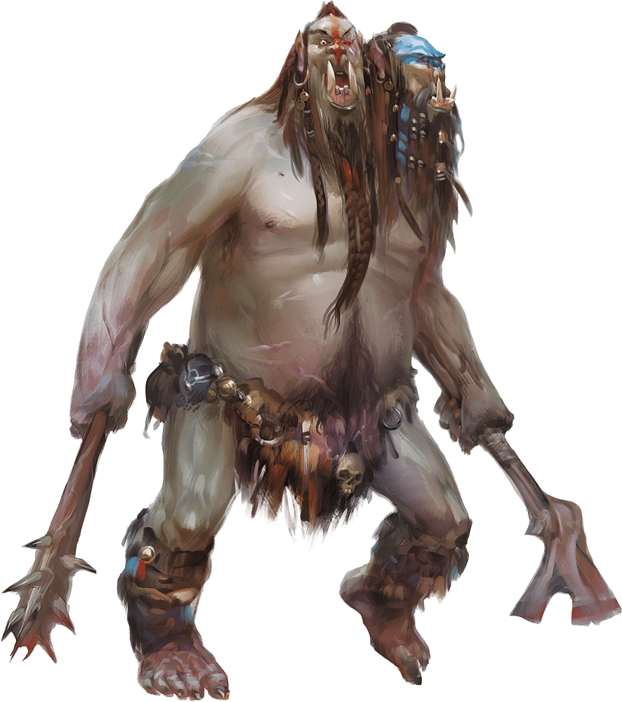

# Palette de Peinture – Ettins (Dungeons & Dragons)

[‹ Back](../index.md)

Les [Ettins](https://www.dndbeyond.com/monsters/16860-ettin) sont des géants à deux têtes, brutaux, sauvages et peu intelligents, issus de l’univers de _Dungeons & Dragons_.

Ils vivent dans des terres désolées, portent des peaux de bêtes, des os et des équipements rustiques.

Voici une palette pour peindre **trois ettins** distincts tout en conservant une cohérence tribale et monstrueuse.

---

## 🪓 Informations générales

- **Origine** : _Dungeons & Dragons_
- **Type** : Géant
- **Taille** : Grand (plus de 3 m)
- **Peau** : Tanné, grisâtre, parfois violacée ou verdâtre
- **Traits** :
  - Deux têtes, poils drus, mâchoires proéminentes
  - Vêtements en cuir, os, fer brut
  - Attitude bestiale et rudimentaire

---

## 🎨 Palette Speedpaint 2.0 – Groupe de Ettins

| Ettin | Peau principale   | Poils / Crasse     | Équipement / pagnes | Détails                            |
| ----- | ----------------- | ------------------ | ------------------- | ---------------------------------- |
| A     | Ashen Stone ✅    | Occultist Cloak ✅ | Brownish Decay ✅   | Pallid Bone ✅ (dents, os)         |
| B     | Ruddy Fur ✅      | Gravelord Grey ✅  | Satchel Brown ✅    | Grim Black ✅ (yeux, ombres)       |
| C     | Desolate Brown ✅ | Grim Black ✅      | Nuclear Sunrise ✅  | Royal Robes ✅ (tatouages tribaux) |

---

## ✅ Couleurs en ta possession

- Ashen Stone
- Occultist Cloak
- Brownish Decay
- Ruddy Fur
- Gravelord Grey
- Satchel Brown
- Grim Black
- Nuclear Sunrise
- Pallid Bone
- Royal Robes

---

💡 Pour différencier les deux têtes d’un même ettin, tu peux utiliser la **même base de peau** mais varier légèrement le lavis ou les poils.  
Ajoute des cicatrices, tatouages, ou peintures de guerre avec des couleurs secondaires (Runic Grey, Poppy Red, Plasmatic Bolt selon ambiance).

## 🖼️ Illustration

