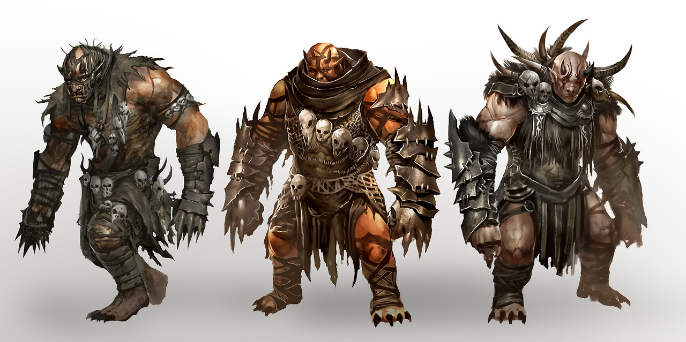
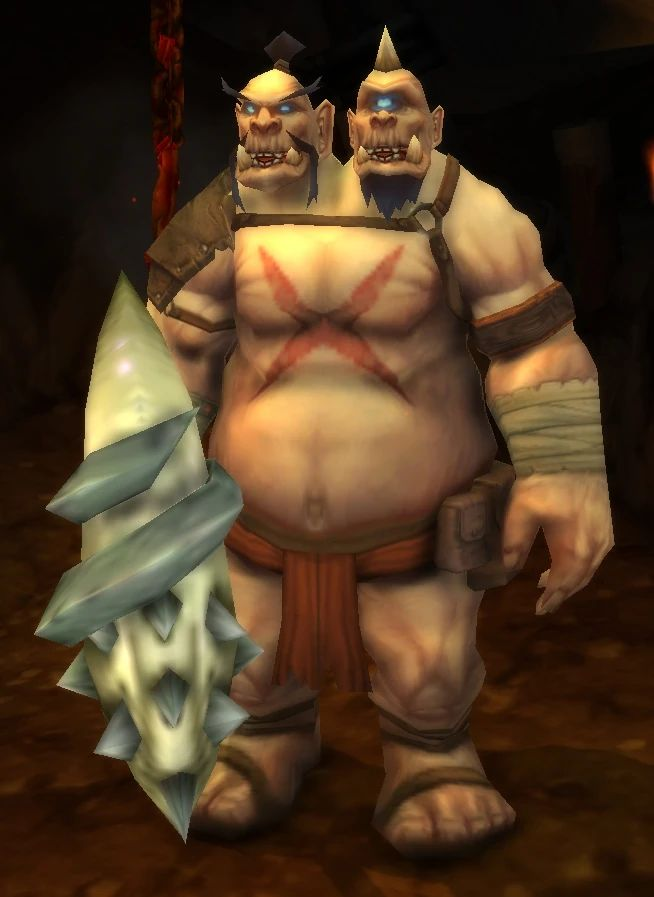

# Palette de Peinture – Ogres (D&D, World of Warcraft, Guild Wars 2)

[‹ Back](../index.md)

Ce document propose trois palettes de peinture **Army Painter Speedpaint 2.0** pour représenter des ogres issus de trois univers distincts :

- [Dungeons & Dragons](https://www.dndbeyond.com/monsters/16969-ogre)
- [World of Warcraft](https://wowpedia.fandom.com/wiki/Ogre)
- [Guild Wars 2](https://wiki.guildwars2.com/wiki/Ogre)

---

## 🪓 1. Ogre – _Dungeons & Dragons_

> [Fiche D&D Beyond](https://www.dndbeyond.com/monsters/16969-ogre)

| Usage              | Couleur            | Commentaire                               |
| ------------------ | ------------------ | ----------------------------------------- |
| Peau pâle-grisâtre | Ashen Stone ✅     | Teinte parfaite pour une peau d’ogre crue |
| Ombres et muscles  | Gravelord Grey ✅  | Accentue la profondeur et les muscles     |
| Armure/leather     | Brownish Decay ✅  | Vieux cuir, bandeaux ou pagnes            |
| Poils / crasse     | Occultist Cloak ✅ | Barbe, cheveux, crasse sous les ongles    |
| Dents / os         | Pallid Bone ✅     | Pour les crânes ou accessoires primitifs  |

---

## 🪙 2. Ogre – _World of Warcraft_

> [Fiche WoWpedia](https://wowpedia.fandom.com/wiki/Ogre)

| Usage                      | Couleur            | Commentaire                                 |
| -------------------------- | ------------------ | ------------------------------------------- |
| Peau rose/jaune/ocre       | Peachy Flesh ✅    | Peau rosée tirant vers le jaune             |
| Ombres chaudes             | Ruddy Fur ✅       | Pour muscler et texturer les creux          |
| Pagnes / cuir grossier     | Satchel Brown ✅   | Tissus, ceintures et pagnes                 |
| Poils / cornes / tatouages | Grim Black ✅      | Accents sur les tatouages ou traits tribaux |
| Détails lumineux           | Nuclear Sunrise ✅ | Runes ou motifs chamaniques magiques        |

---

## 🪓 3. Ogre – _Guild Wars 2_

> [Fiche GW2 Wiki](https://wiki.guildwars2.com/wiki/Ogre)

| Usage                 | Couleur           | Commentaire                                          |
| --------------------- | ----------------- | ---------------------------------------------------- |
| Peau bronze / désert  | Desolate Brown ✅ | Idéal pour un teint mat de steppien                  |
| Ombres terreuses      | Gravelord Grey ✅ | Pour renforcer le relief corporel                    |
| Vêtements tribaux     | Ruddy Fur ✅      | Cuirs et tuniques                                    |
| Marquages / peintures | Royal Robes ✅    | Peinture de guerre bleue typique des clans ogres GW2 |
| Accessoires en os     | Pallid Bone ✅    | Dents, colliers ou armes primitives                  |

---

## ✅ Couleurs que tu possèdes déjà

- Ashen Stone
- Gravelord Grey
- Brownish Decay
- Occultist Cloak
- Pallid Bone
- Peachy Flesh
- Ruddy Fur
- Satchel Brown
- Grim Black
- Royal Robes
- Nuclear Sunrise
- Desolate Brown

---

Toutes ces palettes utilisent des teintes naturelles, tribales ou chamaniques selon le style d’univers.  
Tu peux moduler la saturation (mélange avec du Speedpaint Medium ou Holy White) pour varier les tons de peau et effets de profondeur.

## 🖼️ Illustrations

### Dungeons & Dragons

### Guild Wars 2

### World of WarCraft

