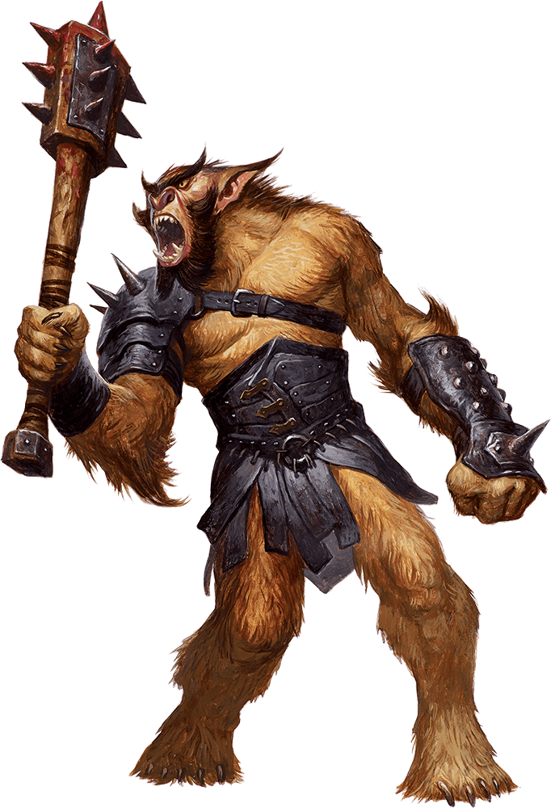

# Palette de Peinture – Bugbears (Dungeons & Dragons)

[‹ Back](../index.md)

Les [Bugbears](https://www.dndbeyond.com/monsters/16817-bugbear) sont des goblinoïdes massifs, poilus et brutaux présents dans l’univers de _Dungeons & Dragons_.  
Ils sont plus grands que les gobelins et hobgobelins, avec une carrure musclée et un pelage dense, souvent comparés à des ours humanoïdes.

Cette palette est conçue pour peindre un **groupe de bugbears** avec variété et cohérence, en exploitant les Speedpaints 2.0.

---

## 🧌 Informations générales

- **Nom** : Bugbear
- **Type** : Humanoïde (goblinoïde)
- **Taille** : Grand (environ 2 m)
- **Caractéristiques** :
  - Peau tanné ou verdâtre, très poilue
  - Dents proéminentes, parfois crochues
  - Vêtements rudimentaires faits de cuir, peaux et os
  - Style tribal, brutal, rustique

---

## 🎨 Palette Speedpaint 2.0 – Bugbear (variante de groupe)

| Usage                     | Couleur             | Commentaire                                            |
| ------------------------- | ------------------- | ------------------------------------------------------ |
| Peau n°1 – Terreuse       | Desolate Brown ✅   | Ton neutre et mat, très naturel                        |
| Peau n°2 – Olivâtre       | Absolution Green ✅ | Pour une touche plus goblinoïde                        |
| Peau n°3 – Brun rougeâtre | Ruddy Fur ✅        | Variante chaude, suggère une origine différente        |
| Poils / crinière          | Grim Black ✅       | Pour une chevelure ou une barbe bien contrastée        |
| Tissu / pagnes            | Satchel Brown ✅    | Cuir brut ou étoffe grossière                          |
| Os, dents, colliers       | Pallid Bone ✅      | Pour les accessoires typiques des tribus               |
| Ombres profondes          | Gravelord Grey ✅   | Pour renforcer les creux musculaires ou sous les poils |

---

## ✅ Couleurs que tu possèdes déjà

- Desolate Brown
- Absolution Green
- Ruddy Fur
- Grim Black
- Satchel Brown
- Pallid Bone
- Gravelord Grey

---

💡 **Varier les peaux** entre les membres du groupe accentue le réalisme tout en gardant l’unité visuelle.  
Ajoute de petits tatouages, cicatrices ou traces de sang pour enrichir le côté brutal et nomade des bugbears.

## 🖼️ Illustration

