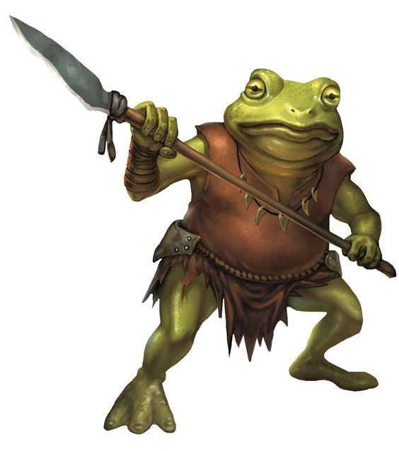

# Palette de Peinture – [Bullywugs](https://forgottenrealms.fandom.com/wiki/Bullywug)

[‹ Back](../index.md)

Les [Bullywugs](https://forgottenrealms.fandom.com/wiki/Bullywug) sont des humanoïdes batraciens vivant dans les marais.

Leur peau peut aller du vert mousseux au brun vaseux, en passant par le jaune maladif ou des teintes de crapauds tropicaux.

Voici plusieurs variantes de palette pour représenter une tribu hétérogène de Bullywugs.

---

## 🐸 Bullywug n°1 – Classique vert marais

| Zone            | Couleur             | Commentaire                              |
| --------------- | ------------------- | ---------------------------------------- |
| Peau principale | Absolution Green ✅ | Vert naturel, batracien classique        |
| Ombres          | Occultist Cloak ✅  | Pour les plis et plis ventraux           |
| Ventre / gorge  | Sand Golem 🛒       | Ton beige crayeux et humide              |
| Yeux / pupilles | Nuclear Sunrise ✅  | Contraste intense de prédateur amphibien |

---

## 🐸 Bullywug n°2 – Teinte jaune-brun vaseux

| Zone             | Couleur           | Commentaire                             |
| ---------------- | ----------------- | --------------------------------------- |
| Peau principale  | Brownish Decay ✅ | Teinte brune terreuse et naturelle      |
| Ombres / plis    | Gravelord Grey ✅ | Assombrit sans casser la texture        |
| Détails pustules | Zealot Yellow ✅  | Parfait pour une peau toxique ou malade |

---

## 🐸 Bullywug n°3 – Crapaud tropical violet/vert

| Zone                | Couleur                | Commentaire                            |
| ------------------- | ---------------------- | -------------------------------------- |
| Peau principale     | Hive Dweller Purple 🛒 | Pour un aspect fongique ou toxique     |
| Membres / dos       | Ghillie Dew 🛒         | Vert olive pour les zones marécageuses |
| Rehauts de pustules | Charming Chartreuse ✅ | Accent lumineux à effet acide          |

---

## ✅ Couleurs en ta possession

- Absolution Green
- Brownish Decay
- Gravelord Grey
- Occultist Cloak
- Zealot Yellow
- Nuclear Sunrise
- Charming Chartreuse

## 🛒 Recommandations

- **Sand Golem** – Pour le ventre clair
- **Hive Dweller Purple** – Variante tropicale ou mutante
- **Ghillie Dew** – Vert fongique / marais organique

---

💡 Pour un effet brillant humide :

- Ajoute un **vernis brillant** sur le ventre ou les pustules
- Glaze de _Charming Chartreuse_ ou _Zealot Yellow_ pour effets toxiques
- Tu peux texturer la peau avec un léger brossage croisé de _Sand Golem_ ou _Gravelord Grey_

## 🖼️ Illustration

