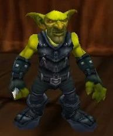

# Palette de Peinture – Gobelins (World of Warcraft)

[‹ Back](../index.md)

Les [gobelins de World of Warcraft](https://wowpedia.fandom.com/wiki/Goblin) sont petits, intelligents, cupides et très expressifs.

Contrairement aux gobelins plus sauvages d'autres univers, ceux de WoW sont souvent des **ingénieurs**, **marchands**, ou **truands** très colorés.

---

## 🧪 Informations générales

- **Origine** : _World of Warcraft_ (Kezan, Bilgewater Cartel)
- **Taille** : Petite
- **Peau** : Teint **vert vif à olive**
- **Traits** : Nez crochu, grandes oreilles, dents pointues, regard moqueur
- **Vêtements** : Colorés, avec du cuir, du métal, et parfois de l’équipement technologique
- **Ambiance** : Chaotique, urbaine, industrielle ou pirate

---

## 🎨 Palette Speedpaint 2.0 – Groupe de Gobelins (WoW)

| Usage                            | Couleur             | Commentaire                                            |
| -------------------------------- | ------------------- | ------------------------------------------------------ |
| Peau gobelin vif (standard)      | Shamrock Green 🛒   | Vert éclatant typique de WoW                           |
| Peau alternative 1 (plus froide) | Absolution Green ✅ | Variante plus désaturée ou gobelin moins vibrant       |
| Peau alternative 2 (plus chaude) | Orc Skin ✅         | Teinte plus olive ou tribale                           |
| Ombres et plis                   | Gravelord Grey ✅   | Pour renforcer les creux ou les contours               |
| Cuirs et bottes                  | Satchel Brown ✅    | Cuirs usés, ceintures, bretelles                       |
| Métal, armes et équipements      | Ashen Stone ✅      | Pour des armatures ou objets techniques                |
| Détails vifs (lunettes, gants)   | Poppy Red ✅        | Contrastes de gobelins ingénieurs                      |
| Effets lumineux / gadgets        | Plasmatic Bolt ✅   | Pour câbles, fioles, effets électriques ou alchimiques |

---

## ✅ Couleurs en ta possession

- Absolution Green
- Orc Skin
- Gravelord Grey
- Satchel Brown
- Ashen Stone
- Poppy Red
- Plasmatic Bolt

## 🛒 À considérer pour achat

- **Shamrock Green** (pour un vrai vert gobelin WoW éclatant)

---

💡 Chaque gobelin peut avoir une peau légèrement différente et des habits plus colorés.  
N'hésite pas à utiliser des couleurs vives sur les accessoires, armes ou gadgets pour souligner leur **ingéniosité explosive**.

## 🖼️ Illustration

