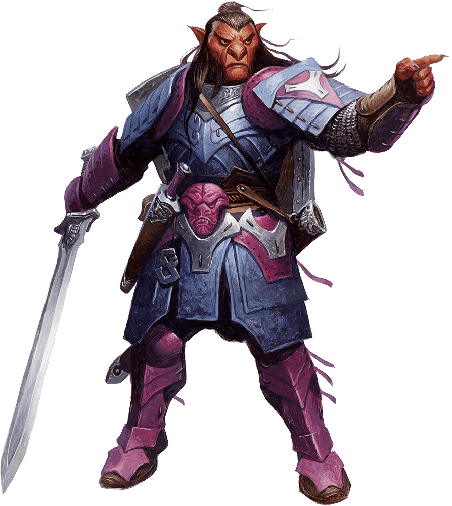

# Palette de Peinture – Hobgobelin (Dungeons & Dragons)

[‹ Back](../index.md)

Les [hobgobelins](https://www.dndbeyond.com/monsters/16925-hobgoblin) sont des goblinoïdes disciplinés, martiaux et organisés, à la différence des gobelins et bugbears.

Ils sont souvent représentés avec une peau rougeâtre ou orangée, des armures métalliques ou en cuir, et un équipement militaire standardisé.

---

## ⚔️ Informations générales

- **Origine** : _Dungeons & Dragons_
- **Taille** : Moyenne
- **Peau** : Teintes allant du **rouge brique au orange cuivré**
- **Traits** : Oreilles pointues, mâchoire carrée, posture droite
- **Vêtements** : Armure de cuir ou de plaques, style romain ou asiatique
- **Comportement** : Hiérarchiques, disciplinés, orientés stratégie

---

## 🎨 Palette Speedpaint 2.0 – Hobgobelin

| Usage                              | Couleur            | Commentaire                                     |
| ---------------------------------- | ------------------ | ----------------------------------------------- |
| Peau hobgobeline                   | Poppy Red ✅       | Rouge saturé, classique pour la peau            |
| Variante plus sombre/cuivrée       | Slaughter Red ✅   | Teinte rouge foncé plus brutale                 |
| Ombres profondes                   | Gravelord Grey ✅  | Pour renforcer les muscles ou la base           |
| Armure métallique / foncée         | Ashen Stone ✅     | Pour une armure de plaques, casque, épées       |
| Cuirs et bottes                    | Satchel Brown ✅   | Ceintures, bottes, pièces d’équipement          |
| Détails militaires (tissus)        | Runic Grey 🛒      | Tuniques sombres, bannières, tabards            |
| Accents de commandement (yeux, or) | Nuclear Sunrise ✅ | Pour insignes, yeux brillants, boucles ou rangs |

---

## ✅ Couleurs en ta possession

- Poppy Red
- Slaughter Red
- Gravelord Grey
- Ashen Stone
- Satchel Brown
- Nuclear Sunrise

## 🛒 À considérer pour achat

- **Runic Grey** (si tu veux des vêtements gris froids ou neutres de type uniforme)

---

💡 Tu peux moduler la peau en mélangeant _Poppy Red_ avec _Ruddy Fur_ ou du _Holy White_ pour créer des hobgobelins plus uniques.  
Ils peuvent aussi recevoir des marques tribales ou militaires en _Occultist Cloak_ ou _Magic Blue_ selon leur grade ou clan.

## 🖼️ Illustration

