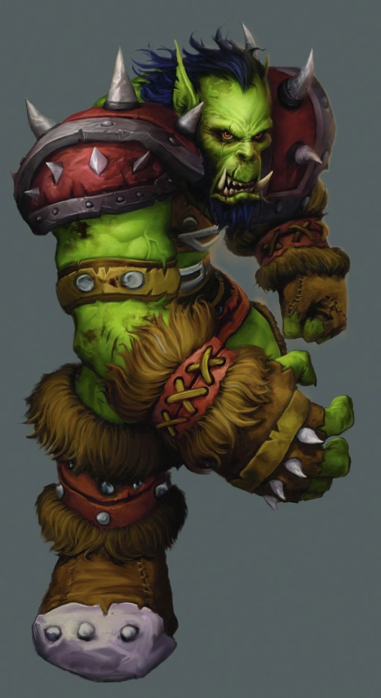

# Palette de Peinture – Orcs (World of Warcraft)

[‹ Back](../index.md)

Dans _World of Warcraft_, les [orcs](https://wowpedia.fandom.com/wiki/Orc) se déclinent en plusieurs **clans** et **teintes de peau**, chacun ayant ses origines, son histoire et ses pouvoirs.

Cette fiche propose des palettes Speedpaint 2.0 pour peindre des orcs de différentes couleurs emblématiques : **vert, rouge, brun, noir**.

---

## 🧟‍♂️ Peau Verte – Orcs classiques (Orcs de Durotar, Clan Warsong, Frostwolf)

| Usage                 | Couleur           | Commentaire                            |
| --------------------- | ----------------- | -------------------------------------- |
| Peau verte standard   | Orc Skin ✅       | Teinte idéale pour les orcs classiques |
| Ombres musculaires    | Gravelord Grey ✅ | Accentue les creux et la puissance     |
| Cuirs et pagnes       | Satchel Brown ✅  | Bottes, ceintures, pagnes tribales     |
| Os / dents / colliers | Pallid Bone ✅    | Détails traditionnels                  |

---

## 🔥 Peau Rouge – Orcs corrompus (Clan Dragonmaw, Fel Orcs, Gul'dan)

| Usage                   | Couleur           | Commentaire                          |
| ----------------------- | ----------------- | ------------------------------------ |
| Peau rouge corrompue    | Poppy Red ✅      | Rouge vif typique des orcs corrompus |
| Variante plus foncée    | Slaughter Red ✅  | Pour variation ou chef plus menaçant |
| Ombres                  | Gravelord Grey ✅ | Renforce l’intensité des volumes     |
| Détails magiques/démons | Plasmatic Bolt ✅ | Marques, veines ou runes fel         |

---

## 🪵 Peau Brune – Orcs originels (Clan Mag'har, orcs non corrompus)

| Usage              | Couleur           | Commentaire                                |
| ------------------ | ----------------- | ------------------------------------------ |
| Peau brune foncée  | Desolate Brown ✅ | Teinte mate et chaude                      |
| Variante rougeâtre | Ruddy Fur ✅      | Pour des visages plus chauds et expressifs |
| Ombres             | Gravelord Grey ✅ | Toujours utile pour accentuer              |

---

## ⚫ Peau Noire – Orcs du Clan Blackrock

| Usage                | Couleur            | Commentaire                               |
| -------------------- | ------------------ | ----------------------------------------- |
| Peau noire brillante | Grim Black ✅      | Pour une base noire intense               |
| Rehauts métalliques  | Ashen Stone ✅     | Pour paliers de lumière et texture        |
| Teinte alternative   | Occultist Cloak ✅ | Pour une peau noire teintée de violet/fel |
| Lumières sombres     | Holy White 🛒      | Pour drybrush spectral ou reflets pâles   |

---

## ✅ Couleurs en ta possession

- Orc Skin
- Poppy Red
- Slaughter Red
- Desolate Brown
- Ruddy Fur
- Gravelord Grey
- Grim Black
- Ashen Stone
- Occultist Cloak
- Satchel Brown
- Pallid Bone
- Plasmatic Bolt

## 🛒 À considérer pour achat

- **Holy White** (pour effets lumineux ou reflets sur peau noire)

---

💡 Combine ces palettes pour créer un **groupe d’orcs visuellement distincts** mais issus du même univers.  
Tu peux ajouter des **marques de clan** (Royal Robes, Nuclear Sunrise, Magic Blue) pour enrichir leur appartenance.

## 🖼️ Illustration

