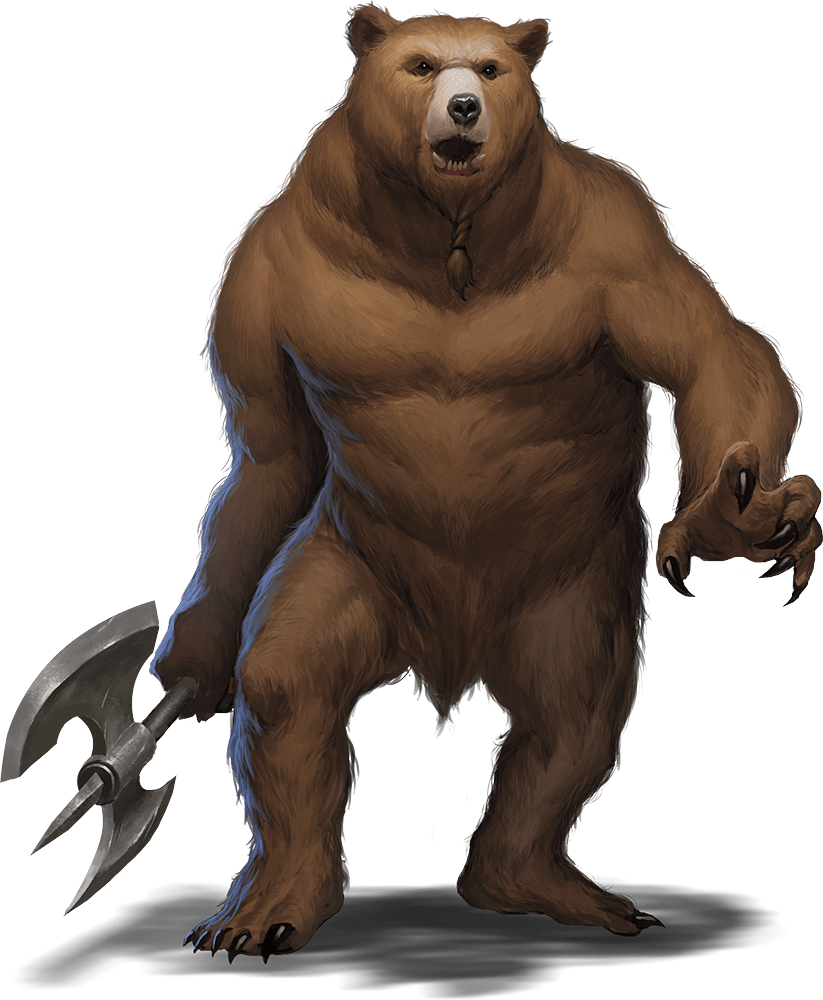

# Palette de Peinture – Werebear (Dungeons & Dragons)

[‹ Back](../index.md)

Le [Werebear](https://www.dndbeyond.com/monsters/17053-werebear) est un lycanthrope noble et puissant, souvent présenté comme un protecteur ou ermite solitaire.

Il prend la forme d’un humanoïde massif à l’apparence d’**ours brun**, parfois gris ou noir selon sa lignée ou son alignement.

---

## 🐻 Forme hybride – Werebear classique (brun)

| Zone                      | Couleur            | Commentaire                                     |
| ------------------------- | ------------------ | ----------------------------------------------- |
| Fourrure principale       | Brownish Decay ✅  | Base chaude et naturelle pour l’ours brun       |
| Ombres et creux           | Gravelord Grey ✅  | Accentue le relief du poil et les articulations |
| Griffes / museau          | Ashen Stone ✅     | Pour les zones osseuses et griffes              |
| Yeux / énergie intérieure | Nuclear Sunrise ✅ | Pour un regard surnaturel ou totemique          |

---

## 🐻 Forme alternative – Werebear gris / alignement neutre

| Zone                       | Couleur            | Commentaire                                    |
| -------------------------- | ------------------ | ---------------------------------------------- |
| Fourrure principale        | Ashen Stone ✅     | Gris clair pour un aspect plus âgé ou mystique |
| Ombres et creux            | Occultist Cloak ✅ | Contraste foncé et profond                     |
| Griffes / dents            | Pallid Bone ✅     | Détail osseux discret                          |
| Éclats rituels / talismans | Royal Robes ✅     | Pour évoquer un côté chamanique ou tribal      |

---

## 👤 Transformation / demi-forme humaine

| Zone                        | Couleur         | Commentaire                        |
| --------------------------- | --------------- | ---------------------------------- |
| Peau humaine                | Peachy Flesh ✅ | Teint humain classique             |
| Zones poilues / en mutation | Ruddy Fur ✅    | Transition de fourrure brune       |
| Détails rituels / tatouages | Poppy Red ✅    | Pour motifs de clan ou malédiction |

---

## ✅ Couleurs en ta possession

- Brownish Decay
- Gravelord Grey
- Ashen Stone
- Nuclear Sunrise
- Occultist Cloak
- Pallid Bone
- Royal Robes
- Peachy Flesh
- Ruddy Fur
- Poppy Red

---

💡 Le **Werebear** peut avoir un aspect noble ou chamanique : n’hésite pas à peindre ses objets, colliers ou totems avec des couleurs contrastantes (ex. _Runic Grey_, _Plasmatic Bolt_, _Magic Blue_) pour un effet mystique.

## 🖼️ Illustration

