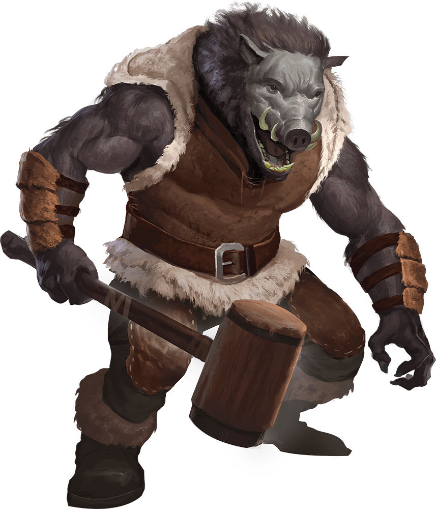

# Palette de Peinture – Wereboar (Dungeons & Dragons)

[‹ Back](../index.md)

Les [Wereboars](https://www.dndbeyond.com/monsters/17054-wereboar) (sangliers-garous) sont des humanoïdes puissants et bestiaux, maudits pour se transformer en créature à l’apparence de **sanglier géant**.

Leur peau épaisse, leur crinière hérissée et leurs défenses imposantes rappellent la brutalité d’un berserker.

---

## 🐗 Forme hybride – Wereboar enragé

| Zone                      | Couleur           | Commentaire                           |
| ------------------------- | ----------------- | ------------------------------------- |
| Peau épaisse / cuir tanné | Desolate Brown ✅ | Base mate, rustique et naturelle      |
| Crinière / poils sombres  | Grim Black ✅     | Pour un effet rugueux et brutal       |
| Ombres et creux           | Gravelord Grey ✅ | Accentue les muscles, pattes, groin   |
| Défenses / dents          | Pallid Bone ✅    | Détail osseux ou ivoire brut          |
| Sang / rage / blessures   | Poppy Red ✅      | Pour un look enragé, récemment blessé |

---

## 👤 Variante transformation / demi-forme

| Zone              | Couleur            | Commentaire                                          |
| ----------------- | ------------------ | ---------------------------------------------------- |
| Peau humaine      | Peachy Flesh ✅    | Pour les zones encore humaines                       |
| Zones de mutation | Ashen Stone ✅     | Transition vers la peau épaisse, apparition de poils |
| Griffes / ongles  | Occultist Cloak ✅ | Noirs et grossiers, en extension                     |

---

## ✅ Couleurs en ta possession

- Desolate Brown
- Grim Black
- Gravelord Grey
- Pallid Bone
- Poppy Red
- Peachy Flesh
- Ashen Stone
- Occultist Cloak

---

💡 Tu peux ajouter un effet de **saleté**, **boue** ou **sang séché** avec des touches légères de _Brownish Decay_ ou _Nuclear Sunrise_ dans les creux.  
Un drybrush de _Pallid Bone_ sur les poils peut simuler un effet sec ou une crinière éclaircie.

## 🖼️ Illustration

