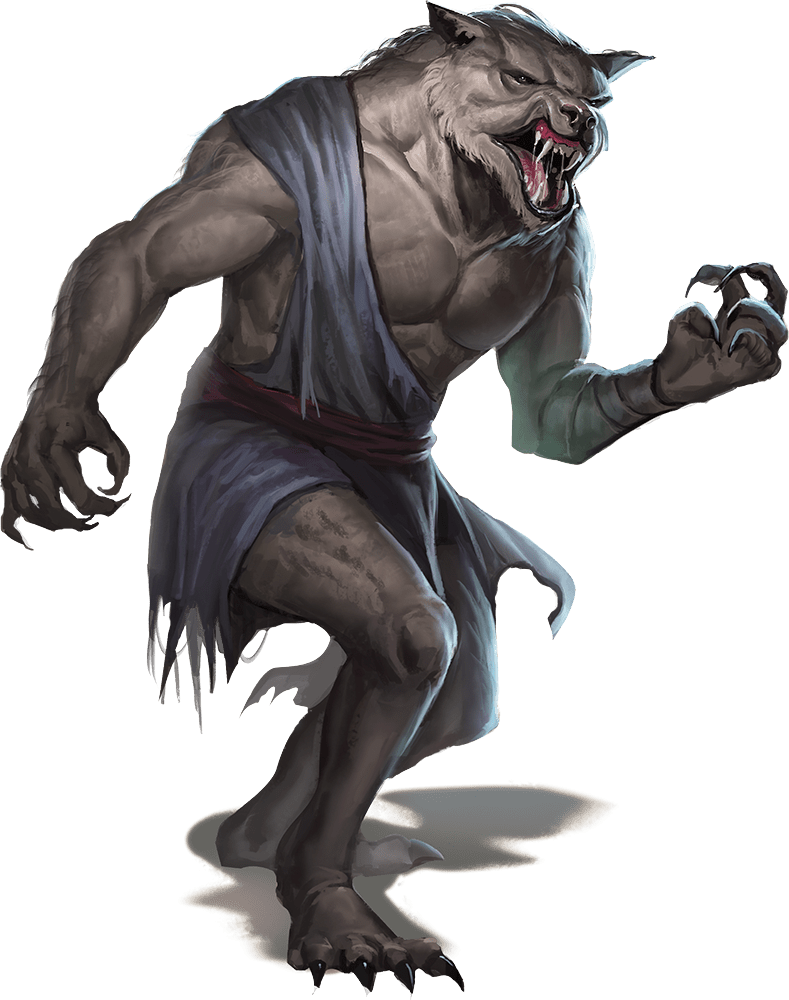

# Palette de Peinture – Loups-Garous (Dungeons & Dragons)

[‹ Back](../index.md)

Les [loups-garous](https://www.dndbeyond.com/monsters/17057-werewolf) sont des humanoïdes maudits pouvant alterner entre forme humaine, hybride et loup.

Voici une palette Speedpaint 2.0 pour représenter :

- **Deux loups-garous différents** (formes hybrides)
- **Un humain en pleine transformation**

---

## 🐺 Loupgarou n°1 – Classique, sombre et menaçant

| Zone                | Couleur            | Commentaire                                     |
| ------------------- | ------------------ | ----------------------------------------------- |
| Fourrure principale | Grim Black ✅      | Pelage noir profond, intense                    |
| Ombres / creux      | Gravelord Grey ✅  | Accentuation des volumes                        |
| Griffes, museau     | Ashen Stone ✅     | Os, crocs, sabots                               |
| Yeux ou lumière     | Nuclear Sunrise ✅ | Jaune vif dans les yeux ou runes de malédiction |

---

## 🐺 Loupgarou n°2 – Sauvage brun-roux

| Zone             | Couleur           | Commentaire                               |
| ---------------- | ----------------- | ----------------------------------------- |
| Fourrure         | Ruddy Fur ✅      | Teinte chaude et naturelle                |
| Ombres           | Gravelord Grey ✅ | Profondeur entre les plaques de muscles   |
| Griffes / crocs  | Pallid Bone ✅    | Os sales ou vieillis                      |
| Marquages / sang | Poppy Red ✅      | Dégâts récents, tatouage ou détail brutal |

---

## 👤 Humain en transformation – Intermédiaire

| Zone                      | Couleur            | Commentaire                             |
| ------------------------- | ------------------ | --------------------------------------- |
| Peau humaine              | Peachy Flesh ✅    | Teint naturel d'humain                  |
| Zone poilue / en mutation | Ashen Stone ✅     | Apparition de fourrure grisâtre         |
| Ombres et veines          | Occultist Cloak ✅ | Pour accentuer les veines, yeux, ongles |
| Yeux ou malédiction       | Plasmatic Bolt ✅  | Lueur bleutée magique ou surnaturelle   |

---

## ✅ Couleurs en ta possession

- Grim Black
- Gravelord Grey
- Ashen Stone
- Ruddy Fur
- Pallid Bone
- Poppy Red
- Nuclear Sunrise
- Peachy Flesh
- Occultist Cloak
- Plasmatic Bolt

---

💡 Pour une figurine en transformation, applique la peinture en **dégradé** du bas vers le haut :  
chair → poils → griffes, avec des veines ou lueurs surnaturelles sur les mains, le visage ou la cage thoracique.  
Tu peux aussi poser quelques déchirures rouges ou noires sur les vêtements pour illustrer la mutation.

## 🖼️ Illustration

