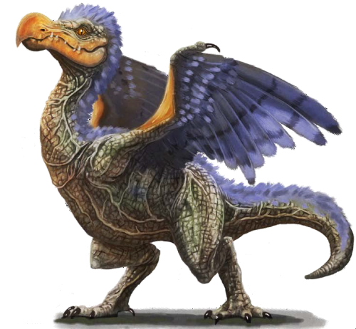

# Palette de Peinture – Jubjub Birds (Fantaisie inspirée de Lewis Carroll)

[‹ Back](../index.md)

Les [Jubjub Birds](https://monstersdownthepath.tumblr.com/post/164070891223/theme-bestiary-jubjub-birds) sont des créatures poétiques, absurdes et dangereuses issues de l’univers de Lewis Carroll (_The Hunting of the Snark_ et _Through the Looking-Glass_).

Ils ont été réinterprétés de nombreuses fois dans la fantasy moderne, comme des **oiseaux exotiques, imposants, colorés et frénétiques** — souvent associés au chaos ou à la jungle.

---

## 🦜 Informations générales

- **Origine** : Littérature de Lewis Carroll, réinterprétée en fantasy
- **Type** : Oiseau géant, magique ou monstrueux
- **Taille** : Moyenne à très grande
- **Ambiance** : Exotique, absurde, souvent menaçante
- **Traits typiques** :
  - Plumage éclatant, souvent **rouge**, **bleu**, **jaune** ou **irisé**
  - Crête hirsute, bec crochu, ailes disproportionnées
  - Souvent présenté comme un **prédateur rapide ou démentiel**

---

## 🎨 Palette Speedpaint 2.0 – Jubjub Birds (Groupe coloré)

| Variante         | Couleur principale  | Compléments                               | Commentaire                             |
| ---------------- | ------------------- | ----------------------------------------- | --------------------------------------- |
| Rouge flamboyant | Poppy Red ✅        | Nuclear Sunrise ✅, Holy White 🛒         | Pour un oiseau agressif et tape-à-l’œil |
| Bleu mystique    | Royal Robes ✅      | Magic Blue 🛒, Blinding Light ✅          | Variante magique, presque surréaliste   |
| Jaune soleil     | Zealot Yellow ✅    | Nuclear Sunrise ✅, Pallid Bone ✅        | Aspect exotique et joyeux               |
| Vert jungle      | Absolution Green ✅ | Charming Chartreuse ✅, Gravelord Grey ✅ | Camouflage vivant ou plumage tropical   |
| Noir dément      | Grim Black ✅       | Plasmatic Bolt ✅, Holy White 🛒          | Pour un oiseau de cauchemar             |

---

## ✅ Couleurs en ta possession

- Poppy Red
- Nuclear Sunrise
- Royal Robes
- Blinding Light
- Zealot Yellow
- Absolution Green
- Charming Chartreuse
- Gravelord Grey
- Pallid Bone
- Grim Black
- Plasmatic Bolt

## 🛒 À considérer pour achat

- **Magic Blue** (pour bleus plus froids)
- **Holy White** (pour pointes brillantes ou éclat spectral)

---

💡 Ces oiseaux étant fantaisistes, tu peux mélanger les couleurs entre les ailes, la tête et la queue.  
Utilise du _Holy White_ ou _Blinding Light_ en brossage léger pour accentuer le mouvement ou la vitesse. Des yeux _Plasmatic Bolt_ ou _Poppy Red_ créent une tension visuelle dramatique.

## 🖼️ Illustration

