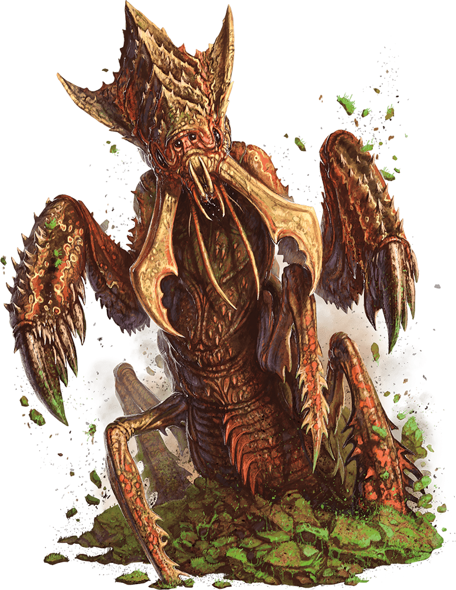

# Palette de Peinture – [Ankheg](https://www.dndbeyond.com/monsters/16787-ankheg)

[‹ Back](../index.md)

Le [Ankheg](https://www.dndbeyond.com/monsters/16787-ankheg) est un énorme insectoïde souterrain, mi-termite mi-scarabée.

Il creuse la terre meuble à la recherche de proies et attaque à l’aide d’acide et de mandibules tranchantes.

Voici une palette Speedpaint 2.0 réaliste et sinistre, incluant une nouvelle teinte terreuse pour renforcer l’effet souterrain.

---

## 🪲 Apparence principale – Ankheg du sol meuble

| Zone                         | Couleur               | Commentaire                                      |
| ---------------------------- | --------------------- | ------------------------------------------------ |
| Carapace principale          | Desolate Brown ✅     | Teinte sèche et terreuse                         |
| Ombres profondes             | Occultist Cloak ✅    | Renforce les articulations et les creux          |
| Griffes / mandibules         | Ashen Stone ✅        | Pour les parties cornées / chitineuses           |
| Pattes / dessous             | Brownish Decay ✅     | Pour les extrémités plus sombres                 |
| Reflets acides / yeux        | Nuclear Sunrise ✅    | Pour le regard et les glandes acides             |
| Lueurs internes (facultatif) | Abomination Vaults 🛒 | Vert-jaune toxique et sale pour fluides internes |

---

## ✅ Couleurs en ta possession

- Desolate Brown
- Occultist Cloak
- Ashen Stone
- Brownish Decay
- Nuclear Sunrise

## 🛒 Recommandation d’achat

- **Abomination Vaults** – Vert sale idéal pour glandes acides ou fluides

---

💡 Applique un lavis de _Occultist Cloak_ dans les creux, puis rehausse la carapace avec _Desolate Brown_.  
Ajoute une touche de _Abomination Vaults_ autour de la bouche ou entre les plaques ventrales pour simuler une lueur toxique ou une humidité organique.

## 🖼️ Illustration

