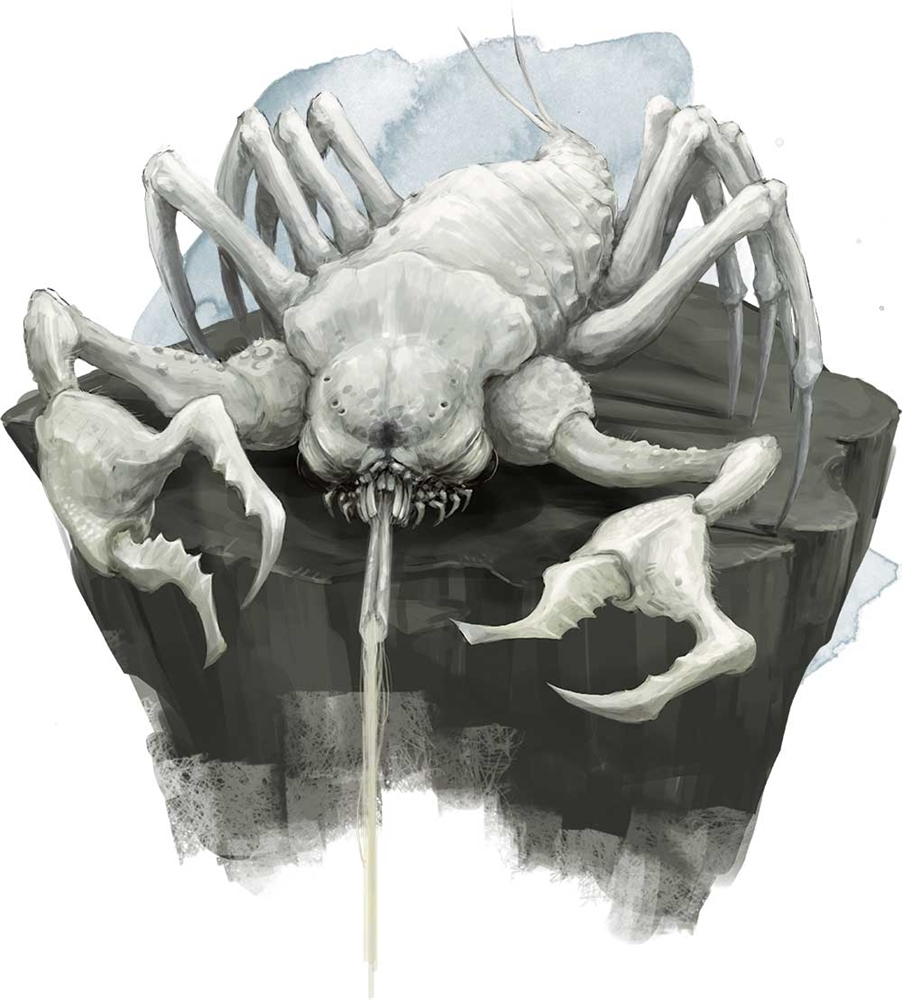

# Palette de Peinture – Cave Fisher (Dungeons & Dragons)

[‹ Back](../index.md)

Le [Cave Fisher](http://dndroll.wikidot.com/creatures:cave-fisher) est une créature insectoïde et cavernicole, rappelant un croisement entre un crabe, un arachnide et un scorpion.

Il chasse depuis les murs ou les plafonds en projetant un filament collant sur ses proies.

Son corps est blindé, chitineux, et souvent décrit comme **rouge orangé**, ce qui le rend particulièrement distinctif dans les ténèbres souterraines.

---

## 🦐 Apparence typique – Cave Fisher de base

| Zone                     | Couleur            | Commentaire                                      |
| ------------------------ | ------------------ | ------------------------------------------------ |
| Carapace principale      | Nuclear Sunrise ✅ | Base orange-jaune brillante et chitineuse        |
| Ombres et articulations  | Gravelord Grey ✅  | Pour séparer les segments et assombrir les creux |
| Membres / griffes        | Grim Black ✅      | Pinces et extrémités acérées                     |
| Yeux / parties sensibles | Poppy Red ✅       | Lueurs biologiques, yeux ou taches actives       |
| Dents / pointes internes | Pallid Bone ✅     | Pour les appendices rigides ou crochets          |
| Fils collants / filament | Plasmatic Bolt ✅  | Filin éthéré, collant ou magique                 |

---

## Variante cavernicole – Cave Fisher albinos / stérile

| Zone                        | Couleur            | Commentaire                                 |
| --------------------------- | ------------------ | ------------------------------------------- |
| Carapace pâle               | Ashen Stone ✅     | Pour un Cave Fisher né dans l’ombre ou muté |
| Ombres plus profondes       | Occultist Cloak ✅ | Pour créer un contraste dramatique          |
| Veines ou résonance magique | Royal Robes ✅     | Énergie souterraine ou marques biologiques  |

---

## ✅ Couleurs en ta possession

- Nuclear Sunrise
- Gravelord Grey
- Grim Black
- Poppy Red
- Pallid Bone
- Plasmatic Bolt
- Ashen Stone
- Occultist Cloak
- Royal Robes

---

💡 Le Cave Fisher peut être peint en finition **semi-brillante** pour simuler un exosquelette lustré.  
Son filament peut recevoir un glaze de _Plasmatic Bolt_ ou _Magic Blue_ pour un effet surnaturel, ou un vernis gloss pour l'effet collant.

## 🖼️ Illustration

