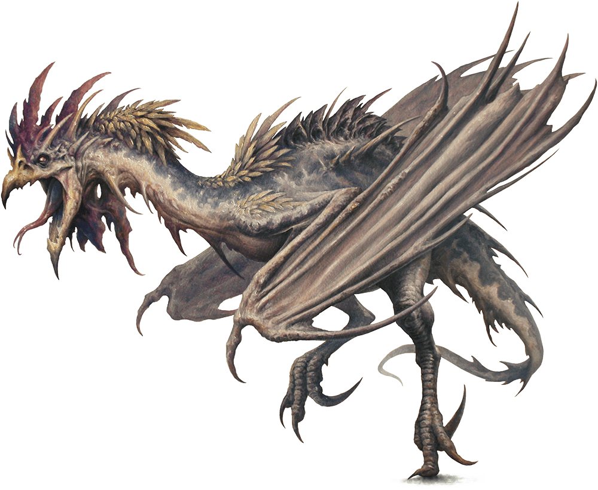

# Palette de Peinture – Cockatrice (Dungeons & Dragons)

[‹ Back](../index.md)

La **Cockatrice** est une créature mythique aux allures de poulet monstrueux, parfois ailée, avec des traits reptiliens.  
Sa morsure pétrifie ses victimes, et son apparence grotesque mêle plumes, écailles et une tête de coq démoniaque.

---

## 🐓 Apparence générale – Poulet infernal / reptilien

| Zone                      | Couleur            | Commentaire                                                      |
| ------------------------- | ------------------ | ---------------------------------------------------------------- |
| Corps (plumes sombres)    | Grim Black ✅      | Base pour le plumage effrayant                                   |
| Crête / chair apparente   | Poppy Red ✅       | Rouge vif classique de crête de coq, combiné à l'effet maléfique |
| Écailles / pattes         | Ashen Stone ✅     | Teinte osseuse ou pierreuse, évoquant la pétrification           |
| Ailes ou reflets magiques | Plasmatic Bolt ✅  | Pour des membranes ou une touche surnaturelle                    |
| Ombres profondes          | Occultist Cloak ✅ | Sous les plumes ou autour des yeux                               |
| Yeux / aura pétrifiante   | Nuclear Sunrise ✅ | Pour un regard jaune doré et étrange                             |

---

## Variante alternative – Cockatrice de marais

| Zone                    | Couleur             | Commentaire                                  |
| ----------------------- | ------------------- | -------------------------------------------- |
| Plumes / peau verte     | Absolution Green ✅ | Base verdâtre pour un style toxique / marais |
| Éclats / pustules / cou | Nuclear Sunrise ✅  | Pour un aspect malade ou magique             |
| Ombres                  | Gravelord Grey ✅   | Pour ancrer visuellement les creux           |
| Griffes / éperons       | Pallid Bone ✅      | Pour les extrémités calcifiées               |

---

## ✅ Couleurs en ta possession

- Grim Black
- Poppy Red
- Ashen Stone
- Plasmatic Bolt
- Occultist Cloak
- Nuclear Sunrise
- Absolution Green
- Gravelord Grey
- Pallid Bone

---

💡 Tu peux accentuer le côté **grotesque et comique** du monstre en peignant les yeux en _Poppy Red_ avec des pupilles verticales _Holy White_ ou _Magic Blue_.  
Un léger **glow** vert ou turquoise autour de la gueule ou des ailes évoquera la magie pétrifiante.

## 🖼️ Illustration

