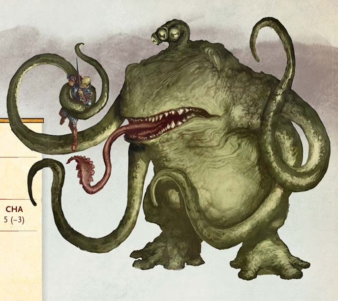

# Palette de Peinture – [Froghemoth](https://media.wizards.com/2016/dnd/downloads/Volo_Froghemoth145.pdf)

[‹ Back](../index.md)

Le [Froghemoth](https://media.wizards.com/2016/dnd/downloads/Volo_Froghemoth145.pdf) est un monstre massif, tentaculaire et amphibien, souvent tapi dans des marais.

Mi-crapaud géant, mi-horreur interdimensionnelle, il mêle des textures visqueuses, des teintes organiques et des éclats lumineux inquiétants.

---

## 🐸 Apparence – Monstre des marais et des astres

| Zone                       | Couleur                | Commentaire                                              |
| -------------------------- | ---------------------- | -------------------------------------------------------- |
| Peau principale            | Ghillie Dew 🛒         | Vert olive gluant pour le dos et les flancs              |
| Ombres / creux             | Occultist Cloak ✅     | Pour les plis entre les tentacules et les plis corporels |
| Ventre / gorge             | Sand Golem 🛒          | Jaune pâle pour les zones ventrales                      |
| Tentacules / appendices    | Ruddy Fur ✅           | Teinte chair brun-rouge pour les bras musclés            |
| Bouches internes / succion | Hive Dweller Purple 🛒 | Pourpre saturé pour les cavités buccales                 |
| Yeux / points lumineux     | Nuclear Sunrise ✅     | Jaune intense et alien pour les yeux globuleux           |

---

## ✅ Couleurs en ta possession

- Occultist Cloak
- Ruddy Fur
- Nuclear Sunrise

## 🛒 Recommandations d’achat

- **Ghillie Dew** – Vert marais naturel et glauque
- **Sand Golem** – Ventre et gorge lisses
- **Hive Dweller Purple** – Cavités internes et contrastes profonds

---

💡 Tu peux brossage sec _Sand Golem_ sur _Ghillie Dew_ pour simuler une texture gluante mais organique.  
Un **lavis léger de _Occultist Cloak_** dans les interstices permet de renforcer la forme, tandis que les yeux en _Nuclear Sunrise_ offrent une tension visuelle vive.  
Ajoute des effets mouillés avec un **vernis brillant** sur les tentacules ou la bouche.

## 🖼️ Illustration

