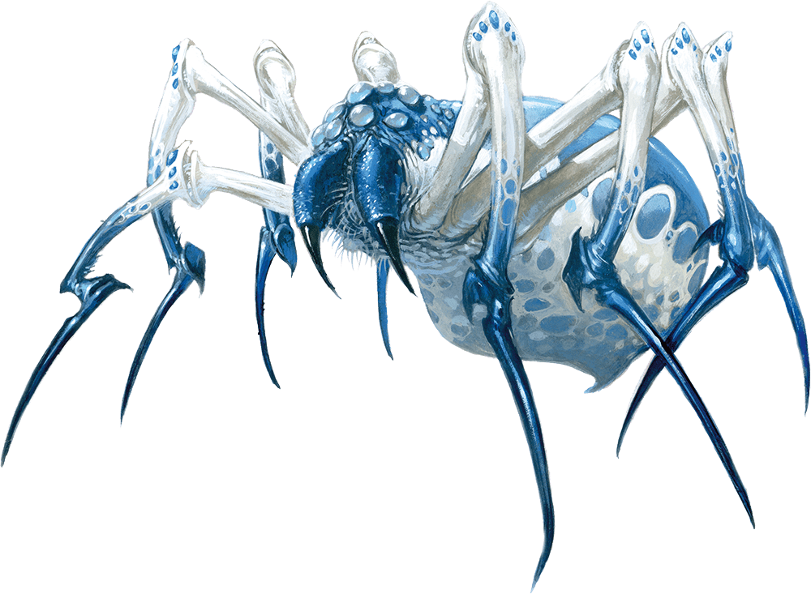

# Palette de Peinture – Phase Spider (Araignée Phase – D&D)

[‹ Back](../index.md)

La [Phase Spider](https://www.dndbeyond.com/monsters/16978-phase-spider) est une créature magique issue de l’univers de _Dungeons & Dragons_.

Elle est capable de se téléporter entre le Plan Matériel et le Plan Éthéré, apparaissant soudainement pour attaquer ses proies.

Son apparence est spectralement dérangeante : **carapace pâle**, **jambes sombres** et **reflets surnaturels**.

---

## 🕷️ Informations générales

- **Origine** : Univers _Dungeons & Dragons_
- **Type** : Monstre magique, arachnide extraplanaire
- **Taille** : Grande
- **Particularités** :
  - Capacité de "phase" (téléportation éthérée)
  - Crocs empoisonnés
  - Apparence semi-translucide ou spectrale

---

## 🎨 Palette Speedpaint 2.0 – Phase Spider

| Usage                             | Couleur            | Commentaire                                                  |
| --------------------------------- | ------------------ | ------------------------------------------------------------ |
| Corps spectral / pâle             | Holy White 🛒      | Base semi-translucide, éclat spectral                        |
| Ombres surnaturelles              | Gravelord Grey ✅  | Parfait pour foncer le dessous ou les jointures              |
| Pattes sombres / carapace dure    | Occultist Cloak ✅ | Pour créer du contraste et une séparation claire             |
| Reflets mystiques (lueur éthérée) | Plasmatic Bolt ✅  | Turquoise froid idéal pour zones magiques ou lueurs internes |
| Détails surnaturels / veines      | Magic Blue 🛒      | Pour ajouter un effet d’énergie vibrante                     |
| Crocs empoisonnés / lueur acide   | Nuclear Sunrise ✅ | Pour les crocs, les glandes ou les impacts toxiques          |

---

## ✅ Couleurs en ta possession

- Gravelord Grey
- Occultist Cloak
- Plasmatic Bolt
- Nuclear Sunrise

## 🛒 À considérer pour achat

- **Holy White** (essentielle pour la base éthérée)
- **Magic Blue** (parfait pour l'effet phase/magique bleuté)

---

💡 Pour un effet magique convaincant, tu peux :

- Diluer _Plasmatic Bolt_ ou _Magic Blue_ avec du medium pour créer des **auras**
- Appliquer _Holy White_ en base puis faire des ombrages progressifs en gris ou turquoise
- Ajouter des **points lumineux** (dotting) pour les yeux ou les marques surnaturelles

## 🖼️ Illustration

