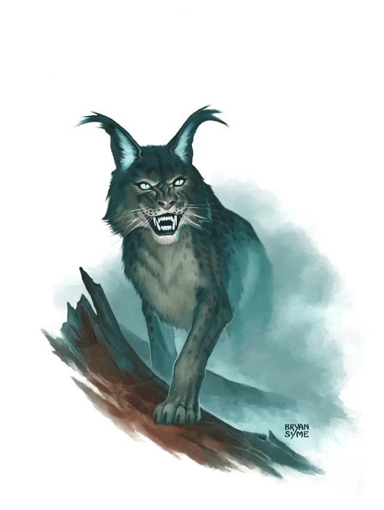

# Palette de Peinture – [Vapor Lynx](https://www.5esrd.com/database/creature/vapor-lynx-3pp/)

[‹ Back](../index.md)

Le [Vapor Lynx](https://www.5esrd.com/database/creature/vapor-lynx-3pp/) est une créature féline surnaturelle, capable de se fondre dans la brume.

Sa fourrure se confond avec la vapeur, mêlant des teintes froides, bleutées, grisées et éthérées.

Voici une palette inspirée de son apparence spectrale et prédatrice.

---

## 🐾 Apparence – Félin éthéré et sylvestre

| Zone                       | Couleur            | Commentaire                                |
| -------------------------- | ------------------ | ------------------------------------------ |
| Fourrure principale        | Runic Grey 🛒      | Gris froid légèrement bleuté, très naturel |
| Ombres / dos / pattes      | Occultist Cloak ✅ | Profondeur dans les creux musculaires      |
| Mèches de brume / lumière  | Holy White 🛒      | Pour simuler l'effet de vapeur en dégradé  |
| Museau / oreilles internes | Ashen Stone ✅     | Pour la zone claire et osseuse du visage   |
| Yeux / aura éthérée        | Magic Blue 🛒      | Pour un regard magique ou surnaturel       |

---

## ✅ Couleurs en ta possession

- Occultist Cloak
- Ashen Stone

## 🛒 Recommandations

- **Runic Grey** – Base spectrale équilibrée
- **Holy White** – Pour brume et éclaircissements subtils
- **Magic Blue** – Pour une touche magique dans les yeux ou le pelage

---

💡 Pour accentuer l’effet de camouflage dans la brume :

- Brosser à sec _Holy White_ sur les flancs et les extrémités
- Ajouter un léger glaze de _Magic Blue_ autour des yeux ou des contours du corps
- Ombres très douces avec _Occultist Cloak_ pour éviter un effet trop marqué

## 🖼️ Illustration

