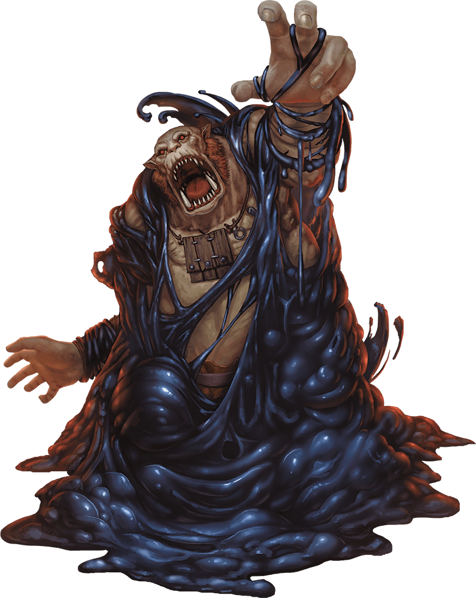

# Palette de Peinture – [Black Pudding](https://www.dndbeyond.com/monsters/16808-black-pudding)

[‹ Back](../index.md)

Le [Black Pudding](https://www.dndbeyond.com/monsters/16808-black-pudding) est une masse gélatineuse et corrosive, noir profond et informe, capable de dissoudre toute matière.

Sa forme souple et glissante peut facilement être adaptée à différentes tailles et teintes en variant reflets et effets visuels.

Voici une proposition de palette pour peindre un groupe complet de Puddings :

**1 boss**, **2 gros**, **2 moyens**, **4 petits**.

---

## 👑 Boss Pudding – Ultra-corrosif

| Zone                 | Couleur            | Commentaire                           |
| -------------------- | ------------------ | ------------------------------------- |
| Masse principale     | Grim Black ✅      | Noir absolu, solide, menaçant         |
| Reflets / aura       | Plasmatic Bolt ✅  | Éclats surnaturels ou toxiques        |
| Éclaboussures acides | Nuclear Sunrise ✅ | Jaune acide visible dans les fissures |
| Ombres profondes     | Occultist Cloak ✅ | Pour structurer sans rigidifier       |

---

## 🟣 Gros Puddings (x2) – Masse instable

| Zone             | Couleur            | Commentaire                             |
| ---------------- | ------------------ | --------------------------------------- |
| Masse principale | Purple Swarm ✅    | Variante violacée d’un pudding plus âgé |
| Ombres           | Occultist Cloak ✅ | Contraste et tension visuelle           |
| Reflets acides   | Magic Blue 🛒      | Viscosité froide / magique              |

---

## 🟤 Moyens Puddings (x2) – Substances luisantes

| Zone             | Couleur           | Commentaire                          |
| ---------------- | ----------------- | ------------------------------------ |
| Masse principale | Brownish Decay ✅ | Teinte sale et amorphe               |
| Reflets / bulles | Plasmatic Bolt ✅ | Pour variation surnaturelle          |
| Ombres           | Gravelord Grey ✅ | Base neutre pour garder le contraste |

---

## 🟢 Petits Puddings (x4) – Débris autonomes

| Variante A | Ghillie Dew 🛒 | Petit pudding verdâtre / toxique |
| Variante B | Hive Dweller Purple 🛒 | Pudding mutant ou corrompu |
| Variante C | Dark Wood 🛒 | Teinte boisée sombre, dissimulation |
| Variante D | Grim Black ✅ | Classique miniature, reflet noir pur |

---

## ✅ Couleurs en ta possession

- Grim Black
- Occultist Cloak
- Plasmatic Bolt
- Purple Swarm
- Brownish Decay
- Nuclear Sunrise
- Gravelord Grey

## 🛒 Recommandations d’achat

- **Magic Blue** – Rehauts froids surnaturels
- **Ghillie Dew** – Teinte marécageuse organique
- **Hive Dweller Purple** – Variation mutante
- **Dark Wood** – Sombre organique sale

---

💡 Applique un **vernis brillant** à tous tes Puddings pour accentuer leur texture visqueuse.  
Tu peux différencier les tailles non seulement par les couleurs, mais aussi par le niveau de glow :  
plus les puddings sont gros, plus les reflets et les lumières internes sont marqués.

## 🖼️ Illustration

