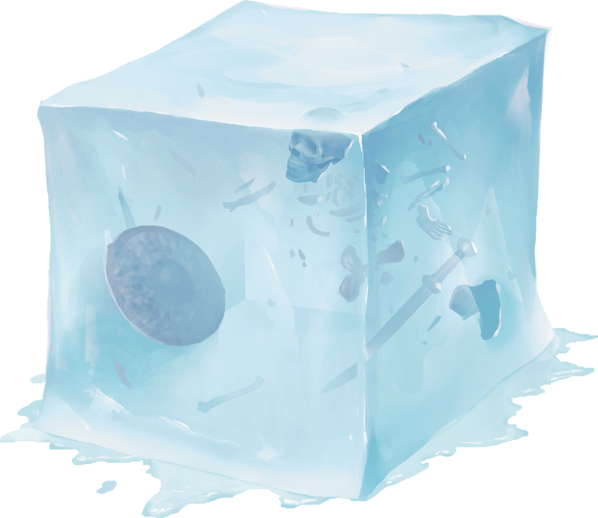

# Palette de Peinture – [Gelatinous Cube](https://www.dndbeyond.com/monsters/16840-gelatinous-cube)

[‹ Back](../index.md)

Le [Gelatinous Cube](https://www.dndbeyond.com/monsters/16840-gelatinous-cube) est un classique des donjons : un **bloc gélatineux et translucide** qui dissout tout sur son passage.

Voici deux variantes de cube aux teintes turquoise opposées :

- Un tirant vers le **bleu/mauve**
- Un autre vers le **jaune/vert**

---

## 🧊 Cube n°1 – Givre psychique (turquoise bleuté-mauve)

| Zone                       | Couleur                | Commentaire                                          |
| -------------------------- | ---------------------- | ---------------------------------------------------- |
| Masse principale           | Magic Blue 🛒          | Base froide et vibrante                              |
| Profondeur / ombre interne | Hive Dweller Purple 🛒 | Reflets profonds dans les coins ou autour des objets |
| Lueurs d’absorption        | Holy White 🛒          | Pour donner un effet spectral ou télépathique        |

---

## 🟩 Cube n°2 – Acide gluant (turquoise vert-jaune)

| Zone                       | Couleur                | Commentaire                                       |
| -------------------------- | ---------------------- | ------------------------------------------------- |
| Masse principale           | Ghillie Dew 🛒         | Teinte marécageuse parfaite pour un cube visqueux |
| Profondeur / ombre interne | Occultist Cloak ✅     | Pour la base ou les zones épaisses                |
| Reflets d’acide / lueurs   | Charming Chartreuse ✅ | Pour la lumière toxique ou les contours           |

---

## ✅ Couleurs en ta possession

- Occultist Cloak
- Charming Chartreuse
- 🎨 Plasmatic Bolt

## 🛒 Recommandations d’achat

- **Magic Blue** – Cube froid et éthéré
- **Hive Dweller Purple** – Ombres mauves surnaturelles
- **Holy White** – Éclats lumineux internes
- **Ghillie Dew** – Base vert acide pour cube organique
- 🎨 Lizardfolk Cyan

---

💡 Applique plusieurs couches diluées pour conserver l’effet translucide, puis termine avec un **vernis brillant épais**.  
Tu peux aussi ajouter des **objets engloutis** (os, arme, sac) peints en _Gravelord Grey_, _Pallid Bone_ ou _Ashen Stone_ pour créer un effet de profondeur.

## 🖼️ Illustration

