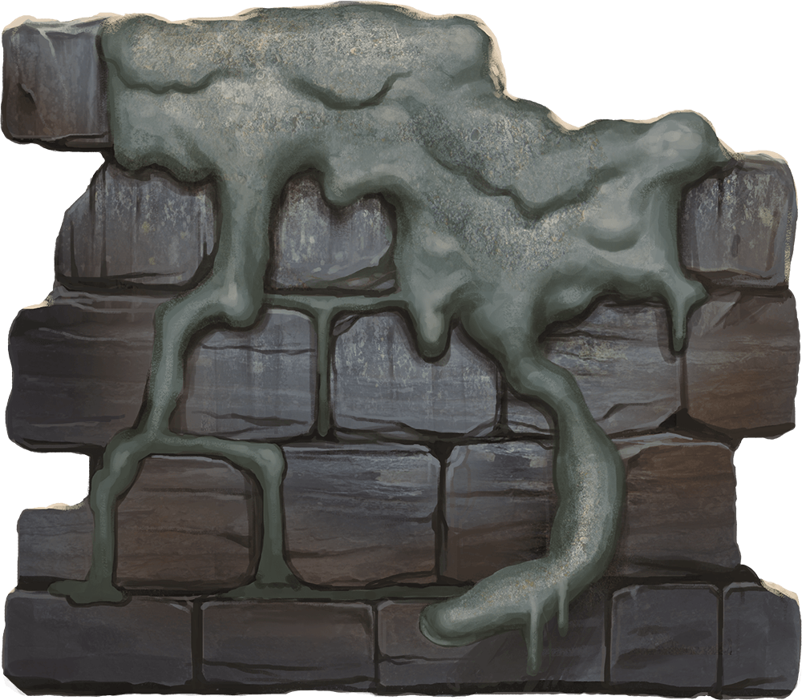

# Palette de Peinture – [Gray Ooze](https://www.dndbeyond.com/monsters/16909-gray-ooze)

[‹ Back](../index.md)

La [Gray Ooze](https://www.dndbeyond.com/monsters/16909-gray-ooze) est une masse gluante et corrosive, semblable à une flaque de métal fondu.

Elle fond les armures, escalade les murs et se camoufle sur les surfaces rocheuses. Voici trois variantes visuelles pour enrichir ton bestiaire.

---

## ⚙️ Ooze n°1 – Métal fondu (classique)

| Zone                  | Couleur            | Commentaire                       |
| --------------------- | ------------------ | --------------------------------- |
| Masse principale      | Gravelord Grey ✅  | Gris foncé et huileux             |
| Ombres / contours     | Occultist Cloak ✅ | Intensifie la forme et les plis   |
| Reflets / métal fondu | Holy White 🛒      | Pour une lueur légèrement chromée |

---

## 🪨 Ooze n°2 – Roche et suintement

| Zone             | Couleur           | Commentaire                                    |
| ---------------- | ----------------- | ---------------------------------------------- |
| Masse principale | Ashen Stone ✅    | Teinte pierreuse et minérale                   |
| Ombres / texture | Brownish Decay ✅ | Détail organique plus terreux                  |
| Reflets internes | Magic Blue 🛒     | Pour un effet magique ou psychique sous-jacent |

---

## 🧪 Ooze n°3 – Acide grisâtre

| Zone             | Couleur          | Commentaire                    |
| ---------------- | ---------------- | ------------------------------ |
| Masse principale | Runic Grey 🛒    | Gris moyen légèrement bleuté   |
| Ombres internes  | Grim Black ✅    | Pour les plis les plus sombres |
| Rehauts toxiques | Zealot Yellow ✅ | Pour un effet d’acidité cachée |

---

## ✅ Couleurs en ta possession

- Gravelord Grey
- Occultist Cloak
- Ashen Stone
- Brownish Decay
- Grim Black
- Zealot Yellow

## 🛒 Recommandations

- **Holy White**
- **Magic Blue**
- **Runic Grey**

---

💡 Vernis **brillant** essentiel. Tu peux appliquer un **lavis de Zealot Yellow** sur le bas des oozes pour simuler des écoulements acides.  
Le _Magic Blue_ peut aussi être utilisé en **halo intérieur** pour suggérer une mutation magique ou une conscience enfouie.

## 🖼️ Illustration

