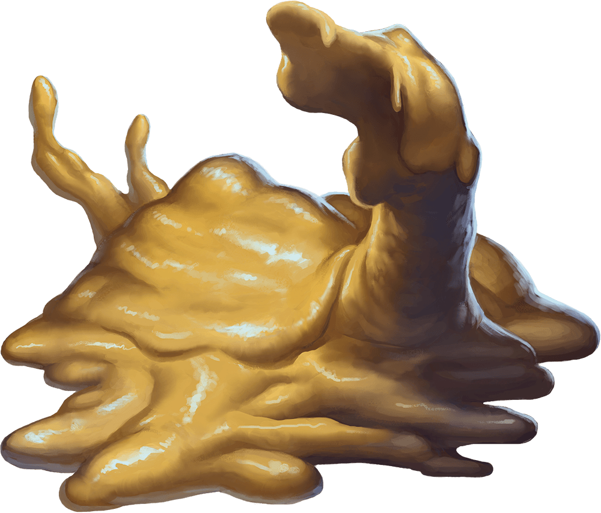

# Palette de Peinture – [Ochre Jelly](https://www.dndbeyond.com/monsters/16967-ochre-jelly)

[‹ Back](../index.md)

Les [Ochre Jellys](https://www.dndbeyond.com/monsters/16967-ochre-jelly) sont des blobs visqueux de teinte ocre ou orangée.

Elles rampent dans les souterrains, dissolvant tout ce qu’elles touchent à l’aide de leurs enzymes acides.

Voici une palette Speedpaint 2.0 adaptée à **1 gros**, **2 moyens** et **4 petits** spécimens.

---

## 🍮 Grand Ochre Jelly – Masse centrale

| Zone              | Couleur                | Commentaire                                    |
| ----------------- | ---------------------- | ---------------------------------------------- |
| Masse principale  | Nuclear Sunrise ✅     | Jaune-orange vif et corrosif                   |
| Ombres profondes  | Occultist Cloak ✅     | Donne de la profondeur dans les zones internes |
| Reflets d’acidité | Charming Chartreuse ✅ | Ajoute de la dimension visuelle toxique        |

---

## 🍯 Moyennes (x2) – Formes en mouvement

| Variante A | Fire Giant Orange 🛒 | Orange foncé brûlant, pour aspect concentré |
| Variante B | Sand Golem 🛒 | Beige ocreuse plus sèche ou ancienne |
| Ombres | Brownish Decay ✅ | Salissure interne / transition vers le marron |

---

## 🍬 Petites (x4) – Résidus et fragments

| Variante A | Ancient Honey 🛒 | Teinte douce et sirupeuse |
| Variante B | Zealot Yellow ✅ | Jaune vif, presque fluorescent |
| Variante C | Charming Chartreuse ✅ | Jaune-vert toxique |
| Variante D | Nuclear Sunrise ✅ | Pour garder une cohérence acide |

---

## ✅ Couleurs en ta possession

- Nuclear Sunrise
- Charming Chartreuse
- Occultist Cloak
- Brownish Decay
- Zealot Yellow

## 🛒 Recommandations

- **Fire Giant Orange**
- **Sand Golem**
- **Ancient Honey**

---

💡 Tu peux différencier les Jellys non seulement par la couleur, mais aussi par leur **transparence**, **texture**, ou **quantité de glow**.  
Utilise un **vernis brillant** systématiquement, et ajoute parfois des **reflets blancs ou jaunes pâles** (_Holy White_ ou _Zealot Yellow_) en point de lumière.

## 🖼️ Illustration

