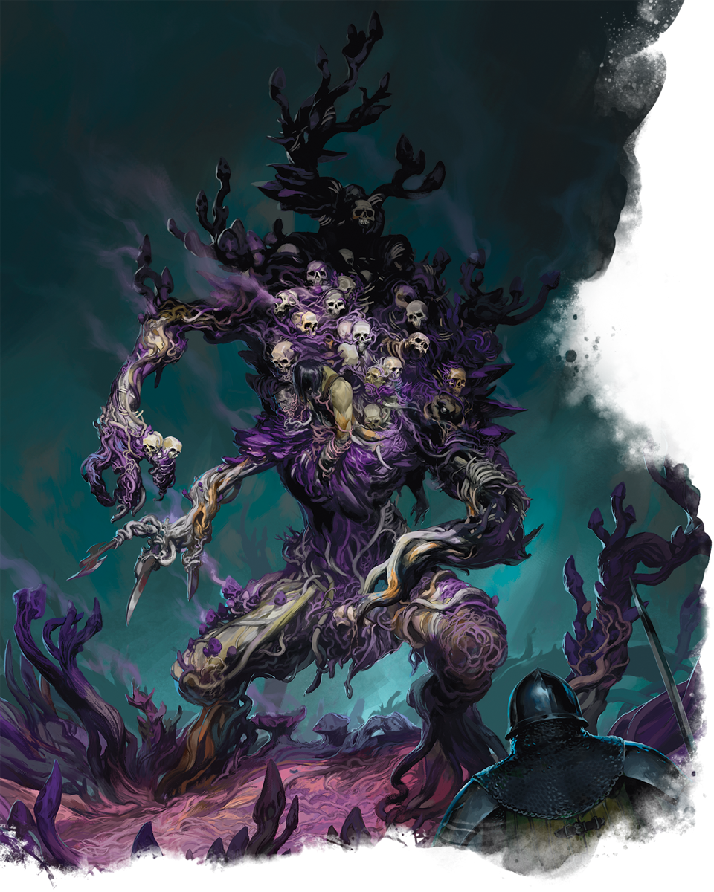

# Palette de Peinture – [Violet Fungus Necrohulk](https://roll20.net/compendium/dnd5e/Monsters:Violet%20Fungus%20Necrohulk?expansion=34653)

[‹ Back](../index.md)

Le [Violet Fungus Necrohulk](https://roll20.net/compendium/dnd5e/Monsters:Violet%20Fungus%20Necrohulk?expansion=34653) est une horreur végétale, une fusion entre une **masse de spores fongiques** et un **cadavre colossal réanimé**.

Il avance lentement, suintant, ses tentacules mous dévorant tout sur leur passage dans une pestilence putride.

---

## 🍄 Apparence – Mycélium géant et charogne animée

| Zone                           | Couleur                | Commentaire                                            |
| ------------------------------ | ---------------------- | ------------------------------------------------------ |
| Chair fongique violette        | Purple Swarm ✅        | Base riche pour les masses centrales                   |
| Ombres internes                | Occultist Cloak ✅     | Pour ancrer visuellement la pourriture                 |
| Tentacules / filaments         | Hive Dweller Purple 🛒 | Variante plus saturée pour différencier les appendices |
| Sporules / pustules            | Nuclear Sunrise ✅     | Teinte maladive pour spores jaunes                     |
| Zones nécrosées / cadavre      | Brownish Decay ✅      | Détails de décomposition et textures mortes            |
| Dents / os                     | Pallid Bone ✅         | Restes d’os ou de crânes fusionnés                     |
| Lumières toxiques (facultatif) | Ghillie Dew 🛒         | Vert glauque pour effet toxique/fongique vivant        |

---

## ✅ Couleurs en ta possession

- Purple Swarm
- Occultist Cloak
- Nuclear Sunrise
- Brownish Decay
- Pallid Bone

## 🛒 Recommandations d’achat

- **Hive Dweller Purple** – Pour appendices fongiques et textures distinctes
- **Ghillie Dew** – Pour effet toxique ou bioluminescent maladif

---

💡 Applique _Purple Swarm_ sur les grandes masses, puis ombre avec _Occultist Cloak_.  
Ajoute des taches ou brossages avec _Hive Dweller Purple_ pour créer des irrégularités visuelles.  
Glaze des zones _Ghillie Dew_ ou _Nuclear Sunrise_ pour suggérer des spores actives ou des zones sensibles.

## 🖼️ Illustration

