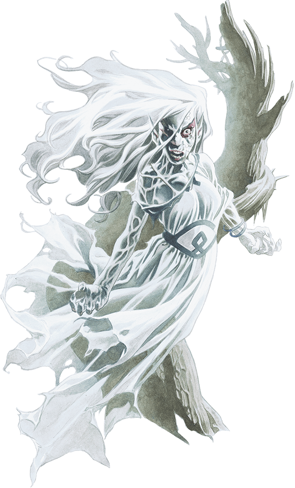

# Palette de Peinture – Banshees (Dungeons & Dragons)

[‹ Back](../index.md)

Les [Banshees](https://www.dndbeyond.com/monsters/17089-banshee) sont des esprits féminins maudits, tourmentés par la souffrance et le regret.

Elles flottent dans l’air, hurlent dans la nuit, et glacent d’effroi ceux qui les aperçoivent.

Cette fiche propose trois variantes visuelles de **Banshee**, en **rose**, **turquoise**, et **bleu**, pour évoquer différentes formes de lamentation.

---

## 🩷 Banshee n°1 – Lamento Rose (Souffrance amoureuse)

| Zone                 | Couleur            | Commentaire                              |
| -------------------- | ------------------ | ---------------------------------------- |
| Corps spectral       | Moonlake Coral ✅  | Base rose pâle et surnaturelle           |
| Ombres / plis        | Occultist Cloak ✅ | Profondeur, plis des voiles              |
| Éclats magiques      | Holy White 🛒      | Pour le halo ou les mains éthérées       |
| Larmes / yeux hantés | Poppy Red ✅       | Suggère une douleur vive et émotionnelle |

---

## 🩵 Banshee n°2 – Hurleuse Turquoise (Écume et noyade)

| Zone                    | Couleur           | Commentaire                                   |
| ----------------------- | ----------------- | --------------------------------------------- |
| Voiles / peau spectrale | Plasmatic Bolt ✅ | Base turquoise vibrante pour effet "noyée"    |
| Ombres fantomatiques    | Gravelord Grey ✅ | Ombres froides sous les yeux ou dans les plis |
| Reflets / lueurs        | Holy White 🛒     | Contours éthérés ou voile humide              |
| Yeux / cris magiques    | Magic Blue 🛒     | Pour un cri spectral ou effet lumineux        |

---

## 🔵 Banshee n°3 – Veuve Bleue (Solitude glacée)

| Zone                   | Couleur            | Commentaire                            |
| ---------------------- | ------------------ | -------------------------------------- |
| Corps spectral         | Royal Robes ✅     | Bleu profond et mystique               |
| Ombres                 | Occultist Cloak ✅ | Pour rendre les creux plus menaçants   |
| Rehauts / aura magique | Blinding Light ✅  | Pour le contraste éthéré et surnaturel |
| Éclat des yeux / cris  | Plasmatic Bolt ✅  | Énergie bleue fantomatique             |

---

## ✅ Couleurs en ta possession

- Moonlake Coral
- Occultist Cloak
- Poppy Red
- Plasmatic Bolt
- Gravelord Grey
- Royal Robes
- Blinding Light

## 🛒 À considérer pour achat

- **Holy White**
- **Magic Blue**

---

💡 Les **Banshees** sont parfaites pour utiliser des **techniques de dégradé**, de **glow** (lueur magique), ou de **vernis satiné** pour simuler un effet spectral et vaporeux.  
Utilise _Holy White_ pour faire ressortir les extrémités (mains, cheveux, bords du voile) et renforcer leur côté surnaturel.

## 🖼️ Illustration

