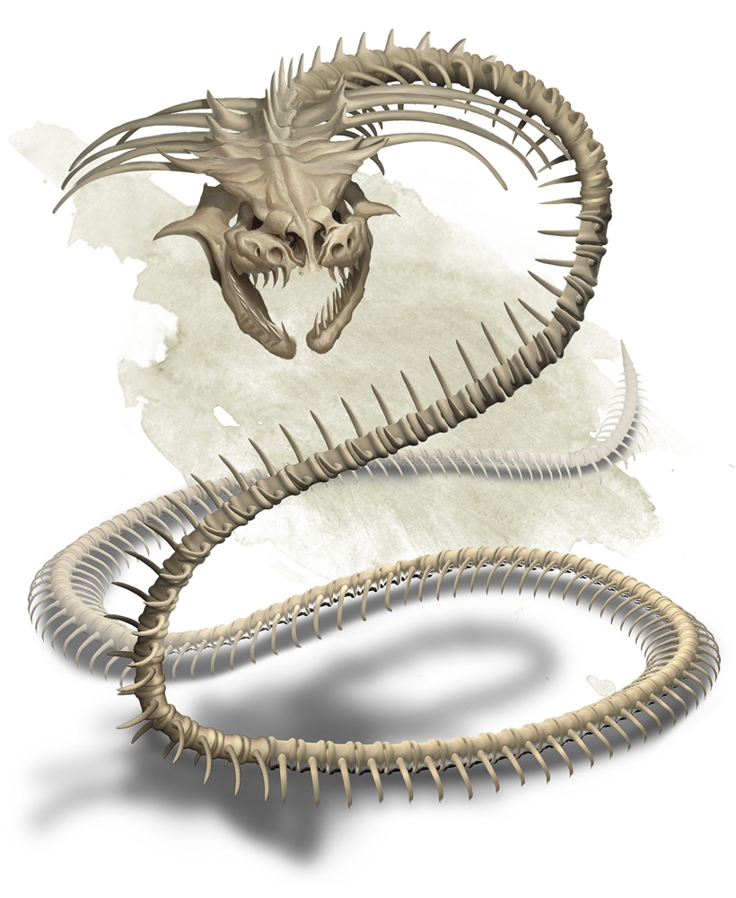

# Palette de Peinture – Bone Naga (Dungeons & Dragons)

[‹ Back](../index.md)

Le [Bone Naga](http://dndroll.wikidot.com/creatures:bone-naga) est un naga squelettique, une créature morte-vivante et magique issue des anciens peuples ophidiens.

Long, sinueux, orné de reliques et de magie noire, il combine **ossature exposée**, **énergie résiduelle**, et parfois des traces de son ancienne noblesse.

---

## ☠️ Apparence principale – Naga spectral et osseux

| Zone                     | Couleur            | Commentaire                                              |
| ------------------------ | ------------------ | -------------------------------------------------------- |
| Os / squelette principal | Pallid Bone ✅     | Base idéale pour les vertèbres, côtes et crâne           |
| Ombres profondes         | Occultist Cloak ✅ | Pour renforcer la structure et creuser les creux         |
| Aura nécromantique       | Plasmatic Bolt ✅  | Pour les veines résiduelles de magie ou les yeux         |
| Bijoux / ornementations  | Royal Robes ✅     | Tissus fanés, gemmes, ou étoffes anciennes               |
| Détails sales / anciens  | Brownish Decay ✅  | Pour les encrassements ou les restes du monde souterrain |
| Yeux / halo magique      | Magic Blue 🛒      | Pour l’intensité spectrale dans les orbites ou les runes |
| Lumière spectrale        | Holy White 🛒      | Pour drybrush inversé ou halo intérieur                  |

---

## ✅ Couleurs en ta possession

- Pallid Bone
- Occultist Cloak
- Plasmatic Bolt
- Royal Robes
- Brownish Decay

## 🛒 Recommandations d’achat

- **Magic Blue** – Pour les yeux, les lignes runiques, les veines enchantées
- **Holy White** – Pour un effet spectral ou un brossage sec éthéré

---

💡 Astuces :

- Tu peux faire un **lavis brun** (_Brownish Decay_) dans les creux osseux, puis éclaircir avec _Pallid Bone_ en brossage.
- Une touche de _Plasmatic Bolt_ ou _Magic Blue_ dilué dans les orbites ou sous la colonne crée une **lueur magique interne**.
- Pour un look plus ancien, tu peux ajouter un peu de _Gravelord Grey_ au bas du corps pour suggérer une poussière de crypte.

## 🖼️ Illustration

