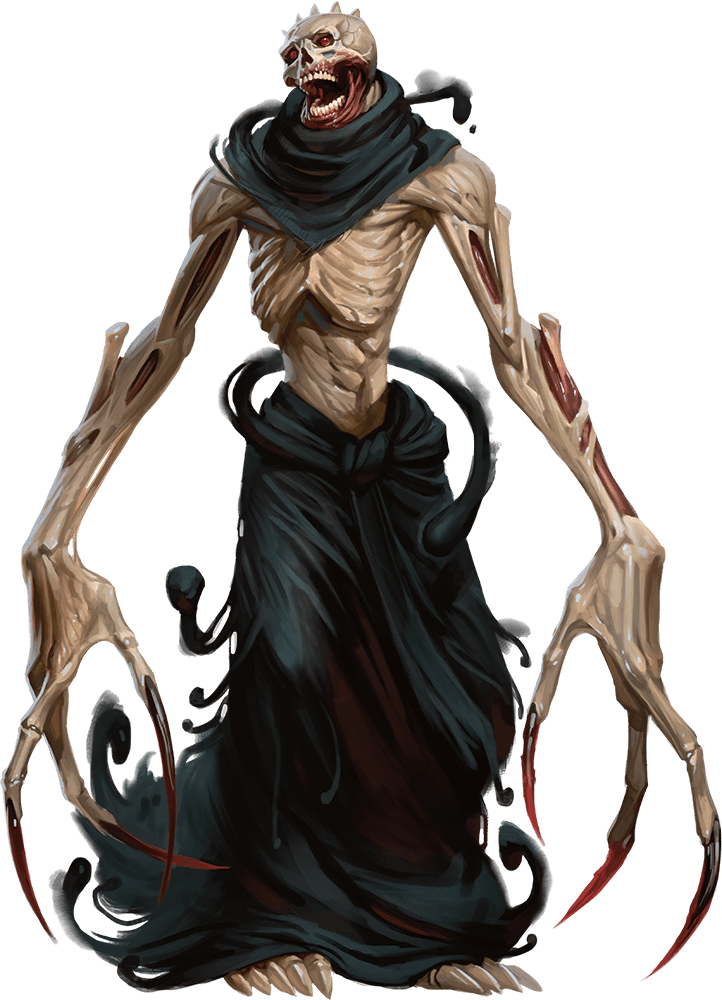

# Palette de Peinture – [Boneclaw](http://dndroll.wikidot.com/creatures:boneclaw)

[‹ Back](../index.md)

Le [Boneclaw](http://dndroll.wikidot.com/creatures:boneclaw) est une créature terrifiante, mi-squelette géant, mi-ombre maléfique.

Créé par la magie ratée d’un nécromancien, il traque sa cible en silence, muni de griffes aussi longues que des épées.

---

## ☠️ Apparence principale – Géant osseux et ombreux

| Zone                        | Couleur            | Commentaire                                               |
| --------------------------- | ------------------ | --------------------------------------------------------- |
| Os / structure principale   | Pallid Bone ✅     | Parfait pour les côtes, crâne, phalanges                  |
| Ombres profondes            | Occultist Cloak ✅ | Pour sculpter la cage thoracique et les creux des membres |
| Griffes immenses            | Ashen Stone ✅     | Pour différencier des os plus denses ou cornés            |
| Ombres corporelles          | Gravelord Grey ✅  | Teinte sombre sur les zones internes ou cachées           |
| Aura / regard maléfique     | Plasmatic Bolt ✅  | Pour des yeux ou une énergie nécrotique persistante       |
| Haillons ou restes de tissu | Grim Black ✅      | Vêtements souillés ou ombres rattachées                   |

---

## ✅ Couleurs en ta possession

- Pallid Bone
- Occultist Cloak
- Ashen Stone
- Gravelord Grey
- Plasmatic Bolt
- Grim Black

---

💡 Le [Boneclaw](http://dndroll.wikidot.com/creatures:boneclaw) se prête bien à une ambiance **noire et osseuse**, avec des zones **ultra contrastées**.

Tu peux peindre les griffes en _Ashen Stone_ puis les assombrir vers les pointes avec _Gravelord Grey_ ou _Occultist Cloak_ en glaze.

Les yeux ou la cage thoracique peuvent briller d’un bleu _Plasmatic Bolt_ pour une **présence hantée**.

## 🖼️ Illustration

