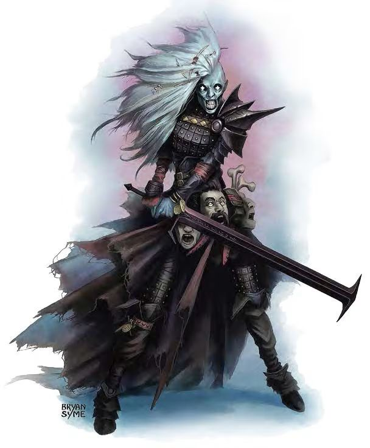

# Palette de Peinture – Fexts (Tome of Beasts – Kobold Press)

[‹ Back](../index.md)

Les [Fexts](https://koboldpress.com/tome-of-beasts-fext/) sont des morts-vivants mystérieux et extrêmement résistants, parfois immortels, souvent le résultat d’expérimentations nécromantiques.

Leur apparence évoque un **humanoïde pâle, vêtu d’armure ou de robes**, avec un regard surnaturel et une aura impie.

Voici une palette pour trois Fexts distincts :

- **1 mage** (intellectuel et spectral)
- **2 guerriers** (martiaux et anciens)

---

## 🧙‍♂️ Fext Mage – Arcaniste immortel

| Zone                   | Couleur            | Commentaire                                      |
| ---------------------- | ------------------ | ------------------------------------------------ |
| Peau cadavérique       | Ashen Stone ✅     | Teint pâle, presque statufié                     |
| Ombres / plis          | Occultist Cloak ✅ | Pour les rides, creux, et orbites                |
| Aura / lueurs magiques | Plasmatic Bolt ✅  | Pour les mains, les veines ou les yeux brillants |
| Robe rituelle          | Royal Robes ✅     | Vêtement noble et ancien                         |
| Détails runiques       | Magic Blue 🛒      | Pour les sorts, parchemins, artefacts            |

---

## 🗡️ Fext Guerrier n°1 – Ancien chevalier

| Zone                  | Couleur            | Commentaire                               |
| --------------------- | ------------------ | ----------------------------------------- |
| Peau morte            | Pallid Bone ✅     | Pour visage exposé ou jointures nues      |
| Armure ancienne       | Ashen Stone ✅     | Métal terni, presque ossifié              |
| Ombres métalliques    | Gravelord Grey ✅  | Pour accentuer les interstices            |
| Détails nobles / cape | Royal Robes ✅     | Pour un effet d’ancienneté aristocratique |
| Yeux surnaturels      | Nuclear Sunrise ✅ | Lueur persistante de non-mort             |

---

## 🛡️ Fext Guerrier n°2 – Brutal et brut

| Zone                   | Couleur            | Commentaire                                           |
| ---------------------- | ------------------ | ----------------------------------------------------- |
| Peau blanchie          | Holy White 🛒      | Teint cadavérique plus pur                            |
| Armure lourde          | Grim Black ✅      | Pour une armure noircie, sinistre                     |
| Ombres / creux         | Occultist Cloak ✅ | Contraste prononcé et sinistre                        |
| Griffes / lame osseuse | Pallid Bone ✅     | Détails secs ou vieilles armes                        |
| Lueurs internes        | Plasmatic Bolt ✅  | Pour un effet d’âme instable ou d’enchantement maudit |

---

## ✅ Couleurs en ta possession

- Ashen Stone
- Occultist Cloak
- Plasmatic Bolt
- Royal Robes
- Pallid Bone
- Gravelord Grey
- Grim Black
- Nuclear Sunrise

## 🛒 Recommandations d’achat

- **Magic Blue** – Pour runes, grimoires, effets magiques froids
- **Holy White** – Pour peau plus spectrale ou halos intérieurs

---

💡 Les Fexts sont parfaits pour des effets **de glow interne**.  
Utilise _Plasmatic Bolt_, _Magic Blue_ ou _Holy White_ dans les orbites, les gantelets ou autour des armes.  
Leurs vêtements ou armures peuvent porter **des marques de clan ou malédictions** à peindre avec des couleurs saturées ou des traits fins.

## 🖼️ Illustration

