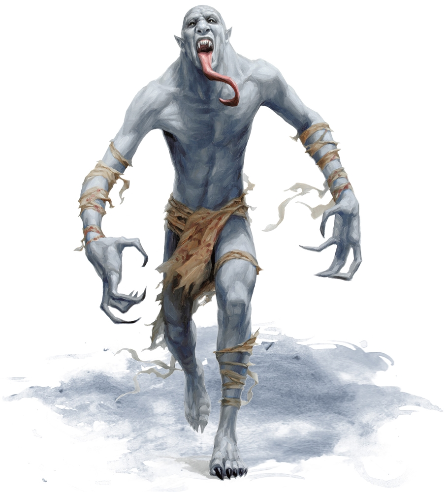

# Palette de Peinture – Ghasts (Dungeons & Dragons)

[‹ Back](../index.md)

Les [Ghasts](https://www.dndbeyond.com/monsters/16870-ghast) sont des goules évoluées, plus intelligentes, plus dangereuses et dotées d’un souffle pestilentiel.

Ils conservent des traits humanoïdes pourrissants et portent parfois des armures ou des trophées de leurs victimes.

Voici une palette Speedpaint 2.0 pour :

- **1 Ghast capitaine** (noble ou meneur)
- **2 Ghasts variants** (marais / crypte)

---

## ☠️ Ghast Capitaine – Putréfaction noble

| Zone                      | Couleur            | Commentaire                               |
| ------------------------- | ------------------ | ----------------------------------------- |
| Peau cadavérique grisâtre | Ashen Stone ✅     | Base froide et figée                      |
| Ombres / creux            | Occultist Cloak ✅ | Intensifie la profondeur, bouche, orbites |
| Armure ou vêtements       | Royal Robes ✅     | Tissu souillé mais élégant                |
| Griffes / crocs           | Pallid Bone ✅     | Dents et serres mortes                    |
| Aura maléfique / yeux     | Plasmatic Bolt ✅  | Pour un regard ou une aura impie          |

---

## 💀 Ghast n°1 – Variante de crypte

| Zone                     | Couleur           | Commentaire                           |
| ------------------------ | ----------------- | ------------------------------------- |
| Peau froide / blafarde   | Holy White 🛒     | Aspect spectral ou momifié            |
| Ombres profondes         | Gravelord Grey ✅ | Base sinistre et glaciale             |
| Dents / os visibles      | Pallid Bone ✅    | Pour les mâchoires ouvertes           |
| Yeux vides / magie noire | Magic Blue 🛒     | Énergie impie froide ou regard maudit |

---

## 💀 Ghast n°2 – Variante de marais ou charognard

| Zone                   | Couleur             | Commentaire                                 |
| ---------------------- | ------------------- | ------------------------------------------- |
| Peau verdâtre infectée | Absolution Green ✅ | Putréfaction et poison                      |
| Ombres / plis          | Brownish Decay ✅   | Teinte sale, chair en décomposition         |
| Dents, griffes         | Pallid Bone ✅      | Extrémités osseuses                         |
| Yeux jaunes            | Nuclear Sunrise ✅  | Pour un regard toxique ou une aura maladive |

---

## ✅ Couleurs en ta possession

- Ashen Stone
- Occultist Cloak
- Royal Robes
- Pallid Bone
- Plasmatic Bolt
- Gravelord Grey
- Absolution Green
- Brownish Decay
- Nuclear Sunrise

## 🛒 Recommandations d’achat

- **Holy White** – Peau fantomatique, éclat spectral
- **Magic Blue** – Aura glacée, yeux morts

---

💡 Les **ghasts** peuvent avoir des restes de peau, de vêtements ou d’os visibles.  
Tu peux drybrusher du _Holy White_ ou du _Pallid Bone_ pour rehausser les textures.  
Pour un effet de **nécromancie active**, applique _Plasmatic Bolt_ ou _Magic Blue_ sur les yeux et les jointures.

## 🖼️ Illustration

