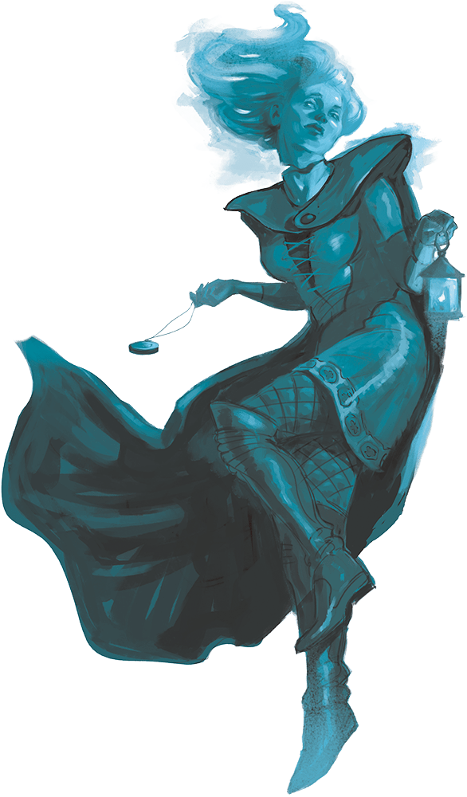

# Palette de Peinture – [Ghost](https://www.dndbeyond.com/monsters/16871-ghost)

[‹ Back](../index.md)

Le [Ghost](https://www.dndbeyond.com/monsters/16871-ghost) est l’esprit tourmenté d’un mort incapable de trouver le repos.

Il flotte dans les ténèbres, intangible, glacial et parfois empreint d’une rage ou d’un chagrin ancien.

Voici deux variantes visuelles basées sur des **tons turquoise**, symboles d’éther et d’entre-deux mondes.

---

## 👻 Ghost n°1 – Spectre glacial (turquoise foncé)

| Zone            | Couleur            | Commentaire                                |
| --------------- | ------------------ | ------------------------------------------ |
| Corps spectral  | Plasmatic Bolt ✅  | Turquoise profond avec reflets surnaturels |
| Ombres / creux  | Occultist Cloak ✅ | Contraste pour yeux, plis, creux           |
| Lumière interne | Holy White 🛒      | Pour l’aura, la base ou les extrémités     |

---

## 👻 Ghost n°2 – Apparition tourmentée (turquoise pâle)

| Zone                 | Couleur            | Commentaire                                     |
| -------------------- | ------------------ | ----------------------------------------------- |
| Corps translucide    | Lizardfolk Cyan 🛒 | Turquoise pâle et spectral, effet d’évanescence |
| Ombres légères       | Gravelord Grey ✅  | Pour définir sans alourdir                      |
| Aura d’agonie / yeux | Magic Blue 🛒      | Pour l’effet de douleur magique                 |

---

## ✅ Couleurs en ta possession

- Plasmatic Bolt
- Occultist Cloak
- Gravelord Grey

## 🛒 Recommandations d’achat

- **Lizardfolk Cyan** – Turquoise clair, parfait pour fantômes éthérés
- **Holy White** – Halo, dégradés vers l’invisible
- **Magic Blue** – Aura magique, pupilles maudites

---

💡 Applique _Plasmatic Bolt_ ou _Lizardfolk Cyan_ en lavis fin ou dégradé, puis brosse à sec avec _Holy White_ ou dilue _Magic Blue_ dans les orbites pour simuler la lumière intérieure.  
N’hésite pas à vernir légèrement pour un effet spectral lustré.

## 🖼️ Illustration

