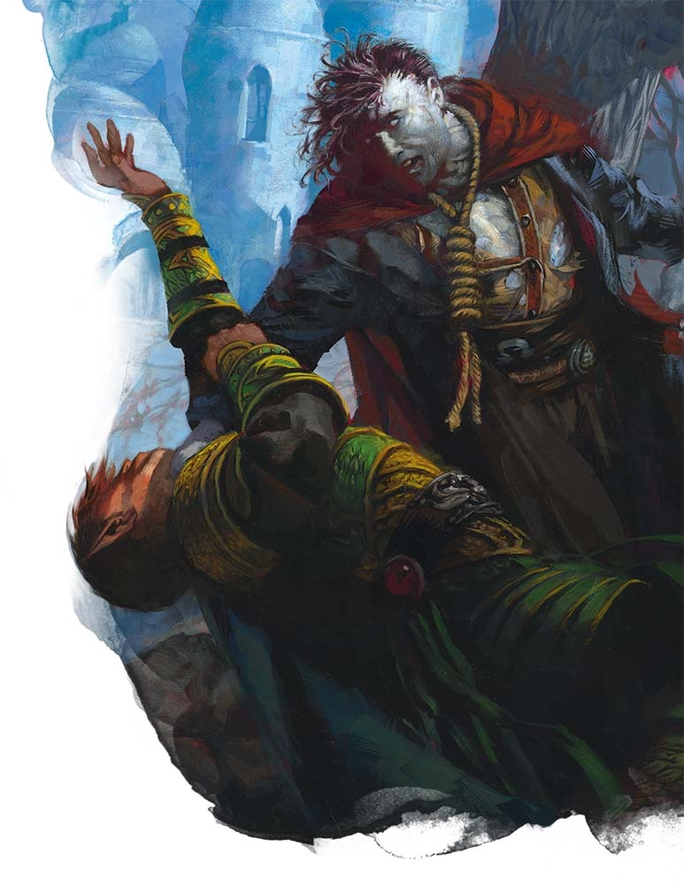

# Palette de Peinture – [Revenant](https://www.dndbeyond.com/monsters/17196-revenant)

[‹ Back](../index.md)

Le [Revenant](https://www.dndbeyond.com/monsters/17196-revenant) est un mort-vivant animée par un désir de vengeance brûlant.

Son corps conserve une apparence humanoïde partiellement décomposée, et ses yeux luisent d’une détermination implacable.

Voici une palette pour peindre une **paire de revenants** aux styles visuels contrastés.

---

## ☠️ Revenant n°1 – Vengeur spectral

| Zone                       | Couleur            | Commentaire                             |
| -------------------------- | ------------------ | --------------------------------------- |
| Peau morte / gris verdâtre | Ashen Stone ✅     | Base pâle pour une chair sans vie       |
| Ombres / creux             | Occultist Cloak ✅ | Accentue les volumes, orbites, côtes    |
| Yeux / lueurs spectrales   | Plasmatic Bolt ✅  | Regard possédé, malédiction persistante |
| Vêtements déchirés         | Royal Robes ✅     | Haillons d’un ancien noble ou prêtre    |
| Griffes / os visibles      | Pallid Bone ✅     | Extrémités, mâchoire, phalanges         |

---

## 🔥 Revenant n°2 – Incendiaire / esprit ardent

| Zone                | Couleur            | Commentaire                          |
| ------------------- | ------------------ | ------------------------------------ |
| Peau brûlée / sèche | Brownish Decay ✅  | Texture rugueuse, chair morte brûlée |
| Ombres profondes    | Gravelord Grey ✅  | Pour un effet desséché et dramatique |
| Yeux enflammés      | Nuclear Sunrise ✅ | Vengeance infernale dans le regard   |
| Vêtements noircis   | Grim Black ✅      | Haillons, chaînes, cuir calciné      |
| Griffes / crocs     | Pallid Bone ✅     | Détail osseux classique              |

---

## ✅ Couleurs en ta possession

- Ashen Stone
- Occultist Cloak
- Plasmatic Bolt
- Royal Robes
- Pallid Bone
- Brownish Decay
- Gravelord Grey
- Nuclear Sunrise
- Grim Black

---

💡 Les [Revenants](https://www.dndbeyond.com/monsters/17196-revenant) se prêtent à une peinture en **contrastant les zones mortes et magiques**.  
Tu peux simuler une **lumière interne** (yeux ou bouche) avec un glaze de _Plasmatic Bolt_ ou _Nuclear Sunrise_, et accentuer la **texture du tissu ou des blessures** par un brossage de _Pallid Bone_ sur _Ashen Stone_.

## 🖼️ Illustration

