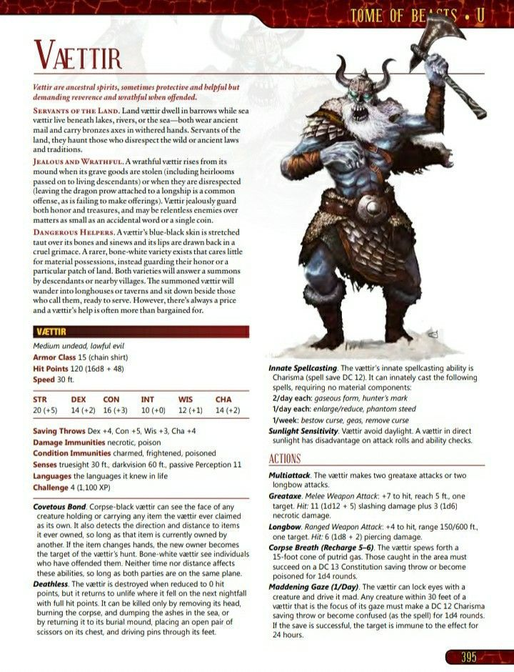

# Palette de Peinture – Vættir (Tome of Beasts – Kobold Press)

[‹ Back](../index.md)

Les **Vættir** sont des esprits ancestraux nordiques, liés à la terre ou à la mer, protecteurs mais impitoyables lorsqu’ils sont offensés.

Leur apparence évoque un **géant spectral au teint bleu-noir**, vêtu d’armure ancienne et orné de symboles tribaux.

Voici une palette Speedpaint 2.0 inspirée de leur illustration dans _Tome of Beasts_.

---

## 🧟‍♂️ Apparence générale – Vaettir terrestre ou marin

| Zone                     | Couleur            | Commentaire                                               |
| ------------------------ | ------------------ | --------------------------------------------------------- |
| Peau bleu-noir           | Purple Swarm ✅    | Base mystique pour le teint spectral                      |
| Ombres profondes         | Occultist Cloak ✅ | Pour renforcer les plis musculaires et l’effet spectral   |
| Cheveux / barbe blanchis | Holy White 🛒      | Pour la barbe longue et l’effet spectral nordique         |
| Yeux / aura magique      | Plasmatic Bolt ✅  | Énergie spectrale ou runique éthérée                      |
| Armure de mailles ternie | Ashen Stone ✅     | Vieux métal sans éclat                                    |
| Fourrure / vêtements     | Brownish Decay ✅  | Pour les textures rustiques de la ceinture et des épaules |
| Ceinture, os, trophées   | Pallid Bone ✅     | Crânes, dents ou décorations anciennes                    |

---

## ✅ Couleurs en ta possession

- Purple Swarm
- Occultist Cloak
- Plasmatic Bolt
- Ashen Stone
- Brownish Decay
- Pallid Bone

## 🛒 À considérer pour achat

- **Holy White** (pour cheveux, barbe, aura spectrale)

---

💡 Pour un effet plus **fantomatique**, tu peux éclaircir les volumes avec un drybrush de _Holy White_ sur la peau, la barbe ou les runes.  
L’aura magique peut être réalisée avec un lavis de _Plasmatic Bolt_ dilué, ou renforcée avec un point de lumière sur les yeux.

## 🖼️ Illustration

